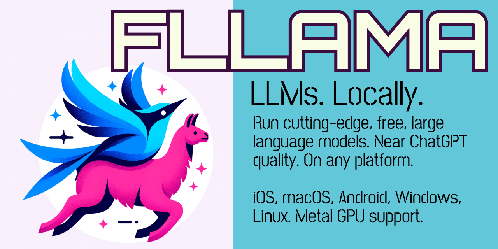

- Everywhere: web, iOS, macOS, Android, Windows, Linux.
- Fast: exceeds average reading speed on all platforms except web.
- Private: No network connection, server, cloud required.
- Forward compatible: Any model compatible with llama.cpp. (so, every model.)
- Full OpenAI compatability: chat messages, multimodal/image support via LLaVa models, and function calling. (constrain outputs to valid JSON based on a JSON schema) 
- Bare metal interface: call LLMs without being constrained to a chat implementation.
- Use with FONNX for RAG
  - Combine with [FONNX](https://github.com/Telosnex/fonnx) to have a full retrieval-augmented generation stack available on all platforms.

## CI builds
| Platform     | Status |
|--------------|--------|
| __Android__  | [](https://codemagic.io/apps/652897766ee3f7af8490a79f/652b298fe7e0c7e9e4cb275f/latest_build) |
| __iOS__  | [](https://codemagic.io/apps/652897766ee3f7af8490a79f/652b298fe7e0c7e9e4cb275f/latest_build) |
| __Linux__    | [](https://codemagic.io/apps/661bdc0af8dd02f68c5475b7/linux-build/latest_build) |
| __macOS__ | [](https://codemagic.io/apps/652897766ee3f7af8490a79f/macos-build/latest_build) |
| __Web__  | [](https://codemagic.io/apps/652897766ee3f7af8490a79f/652b298fe7e0c7e9e4cb275f/latest_build) |
| __Windows__  | [](https://codemagic.io/apps/652897766ee3f7af8490a79f/652b298fe7e0c7e9e4cb275f/latest_build) |

## Recent updates
### 26 Feb 2024
- Web is now based on WASM compiled from FLLAMA itself, rather than just llama.cpp, guaranteeing native/web parity.
- Tokenizing strings based on the model is 1000x faster, via caching the model. Went from O(300 ms) on native only to O(0.2 ms) on web, O(0.00001 ms) on native. This enables calculating what strings will be in context based on the context size.
- Method renames for consistency, correctness, and clarity. (ex. remove *Async from names, because all methods are async; rename `fllamaChatCompletionAsync` to `fllamaChat`)
- Document methods and updated example. TL;DR: Use `fllamaChat` unless you're doing something funny with LLMs that isn't user-facing, it will act like a true text completion engine instead of a chatbot.

## Integrate
- Add this to your package's pubspec.yaml file:
```yaml
dependencies:
  fllama:
    git:
      url: https://github.com/Telosnex/fllama.git
      ref: main
```
- Run inference:
```dart
import 'package:fllama/fllama.dart';

String latestResult = "";

final request = OpenAiRequest(
  maxTokens: 256,
  messages: [
    Message(Role.system, 'You are a chatbot.'),
    Message(Role.user, messageText),
  ],
  numGpuLayers: 99, /* this seems to have no adverse effects in environments w/o GPU support, ex. Android and web */
  modelPath: _modelPath!,
  mmprojPath: _mmprojPath,
  frequencyPenalty: 0.0,
  // Don't use below 1.1, LLMs without a repeat penalty
  // will repeat the same token.
  presencePenalty: 1.1,
  topP: 1.0,
  // Proportional to RAM use. 
  // 4096 is a good default. 
  // 2048 should be considered on devices with low RAM (<8 GB)
  // 8192 and higher can be considered on device with high RAM (>16 GB)
  // Models are trained on <= a certain context size. Exceeding that # can/will lead to completely incoherent output.
  contextSize: 2048,
  // Don't use 0.0, some models will repeat the same token.
  temperature: 0.1,
  logger: (log) {
    // ignore: avoid_print
    print('[llama.cpp] $log');
  },
);
fllamaChat(request, (response, done) {
    setState(() {
      latestResult = response;
    });
});
```
## Tips & Tricks
### Web
  Web is __extremely__ slow, ex. on a MBP M2 Max with 64 VRAM, it does ~2 tokens/second with a 3B parameter model. It's best seen as validation for your users that you will strive to support free LLMs everywhere.
  To install: copy the fllama_wasm* files from `example/web` to your app's `web` directory, then add the `<script>` tag in `example/web/index.html`.
### Recommended models
  3 top-tier open models are in the [fllama HuggingFace repo](https://huggingface.co/telosnex/fllama/tree/main).
  - __Stable LM 3B__ is the first LLM model that can handle RAG, using documents such as web pages to answer a query, on *all* devices. 
  > Mistral models via [Nous Research](https://nousresearch.com/).
    They trained and finetuned the Mistral base models for chat to create the OpenHermes series of models.
  - __Mistral 7B__ is best on 2023 iPhones or 2024 Androids or better.
    It's about 2/3 the speed of Stable LM 3B and requires 5 GB of RAM.
  - __Mixtral 8x7B__ should only be considered on a premium laptop or desktop,
    such as an M-series MacBook or a premium desktop purchased in 2023
    or later. It's about 1/3 the speed of Stable LM 3B and requires 
    26 GB of RAM.
### RAM Requirements
  Roughly: you'll need as much RAM as the model file size.
  If inference runs on CPU, that much regular RAM is required.
  If inference runs on GPU, that much GPU RAM is required.
### Download files from HuggingFace at runtime
  HuggingFace, among many things, can be thought of as GitHub for AI models.
  You can download a model from HuggingFace and use it with fllama.
  To get a download URL at runtime, see below.
  ```dart
  String getHuggingFaceUrl(
    {required String repoId,
    required String filename,
    String? revision,
    String? subfolder}) {
  // Default values
  const String defaultEndpoint = 'https://huggingface.co';
  const String defaultRevision = 'main';

  // Ensure the revision and subfolder are not null and are URI encoded
  final String encodedRevision =
      Uri.encodeComponent(revision ?? defaultRevision);
  final String encodedFilename = Uri.encodeComponent(filename);
  final String? encodedSubfolder =
      subfolder != null ? Uri.encodeComponent(subfolder) : null;

  // Handle subfolder if provided
  final String fullPath = encodedSubfolder != null
      ? '$encodedSubfolder/$encodedFilename'
      : encodedFilename;

  // Construct the URL
  final String url =
      '$defaultEndpoint/$repoId/resolve/$encodedRevision/$fullPath';

  return url;
}
```

# Licensing

FLLAMA is licensed under a dual-license model.

The code as-is on GitHub is licensed under GPL v2. That requires distribution of the integrating app's source code, and this is unlikely to be desirable for commercial entities. See LICENSE.md.

Commercial licenses are also available. Contact info@telosnex.com. Expect very fair terms: our intent is to charge only entities, with a launched app, making a lot of money, with FLLAMA as a core dependency. The base agreement is here: https://github.com/lawndoc/dual-license-templates/blob/main/pdf/Basic-Yearly.pdf

# Web development
- When C++ changes, use ./build-wasm.sh to build updated WASM files.
- Copy: fllama_wasm.js, fllama_wasm.wasm, fllama_wasm.worker.mjs from wasm_build/build to example/web directory.
- flutter run -d web-server --web-hostname=localhost --web-port=1234
- Open Chrome and go to http://localhost:1234.
- Enable WASM via modheader extension, set:
Cross-Origin-Embedder-Policy: require-corp
Cross-Origin-Opener-Policy: same-origin
