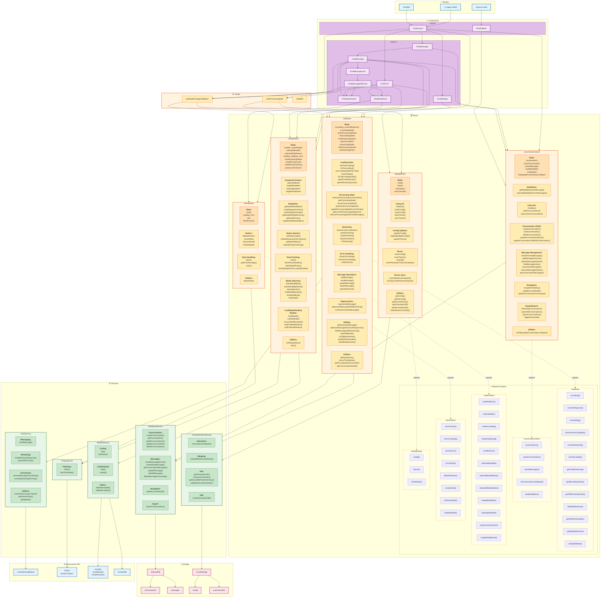

```mermaid
flowchart TB
subgraph Routes["📍 Routes"]
R1["/ (+page.svelte)"]
R2["/chat/[id]"]
RL["+layout.svelte"]
end

    subgraph Components["🧩 Components"]
        direction TB
        subgraph LayoutComponents["Layout"]
            C_Sidebar["ChatSidebar"]
            C_Screen["ChatScreen"]
        end
        subgraph ChatUIComponents["Chat UI"]
            C_Form["ChatForm"]
            C_Messages["ChatMessages"]
            C_Message["ChatMessage"]
            C_MessageUser["ChatMessageUser"]
            C_MessageEditForm["ChatMessageEditForm"]
            C_Attach["ChatAttachments"]
            C_ModelsSelector["ModelsSelector"]
            C_Settings["ChatSettings"]
        end
    end

    subgraph Hooks["🪝 Hooks"]
        H1["useModelChangeValidation"]
        H2["useProcessingState"]
        H3["isMobile"]
    end

    subgraph Stores["🗄️ Stores"]
        direction TB
        subgraph S1["chatStore"]
            S1State["<b>State:</b><br/>isLoading, currentResponse<br/>errorDialogState<br/>activeProcessingState<br/>chatLoadingStates<br/>chatStreamingStates<br/>abortControllers<br/>processingStates<br/>activeConversationId<br/>isStreamingActive"]
            S1LoadState["<b>Loading State:</b><br/>setChatLoading()<br/>isChatLoading()<br/>syncLoadingStateForChat()<br/>clearUIState()<br/>isChatLoadingPublic()<br/>getAllLoadingChats()<br/>getAllStreamingChats()"]
            S1ProcState["<b>Processing State:</b><br/>setActiveProcessingConversation()<br/>getProcessingState()<br/>clearProcessingState()<br/>getActiveProcessingState()<br/>updateProcessingStateFromTimings()<br/>getCurrentProcessingStateSync()<br/>restoreProcessingStateFromMessages()"]
            S1Stream["<b>Streaming:</b><br/>streamChatCompletion()<br/>startStreaming()<br/>stopStreaming()<br/>stopGeneration()<br/>isStreaming()"]
            S1Error["<b>Error Handling:</b><br/>showErrorDialog()<br/>dismissErrorDialog()<br/>isAbortError()"]
            S1Msg["<b>Message Operations:</b><br/>addMessage()<br/>sendMessage()<br/>updateMessage()<br/>deleteMessage()<br/>getDeletionInfo()"]
            S1Regen["<b>Regeneration:</b><br/>regenerateMessage()<br/>regenerateMessageWithBranching()<br/>continueAssistantMessage()"]
            S1Edit["<b>Editing:</b><br/>editAssistantMessage()<br/>editUserMessagePreserveResponses()<br/>editMessageWithBranching()<br/>clearEditMode()<br/>isEditModeActive()<br/>getAddFilesHandler()<br/>setEditModeActive()"]
            S1Utils["<b>Utilities:</b><br/>getApiOptions()<br/>parseTimingData()<br/>getOrCreateAbortController()<br/>getConversationModel()"]
        end
        subgraph S2["conversationsStore"]
            S2State["<b>State:</b><br/>conversations<br/>activeConversation<br/>activeMessages<br/>usedModalities<br/>isInitialized<br/>titleUpdateConfirmationCallback"]
            S2Modal["<b>Modalities:</b><br/>getModalitiesUpToMessage()<br/>calculateModalitiesFromMessages()"]
            S2Lifecycle["<b>Lifecycle:</b><br/>initialize()<br/>loadConversations()<br/>clearActiveConversation()"]
            S2ConvCRUD["<b>Conversation CRUD:</b><br/>createConversation()<br/>loadConversation()<br/>deleteConversation()<br/>updateConversationName()<br/>updateConversationTitleWithConfirmation()"]
            S2MsgMgmt["<b>Message Management:</b><br/>refreshActiveMessages()<br/>addMessageToActive()<br/>updateMessageAtIndex()<br/>findMessageIndex()<br/>sliceActiveMessages()<br/>removeMessageAtIndex()<br/>getConversationMessages()"]
            S2Nav["<b>Navigation:</b><br/>navigateToSibling()<br/>updateCurrentNode()<br/>updateConversationTimestamp()"]
            S2Export["<b>Import/Export:</b><br/>downloadConversation()<br/>exportAllConversations()<br/>importConversations()<br/>triggerDownload()"]
            S2Utils["<b>Utilities:</b><br/>setTitleUpdateConfirmationCallback()"]
        end
        subgraph S3["modelsStore"]
            S3State["<b>State:</b><br/>models, routerModels<br/>selectedModelId<br/>selectedModelName<br/>loading, updating, error<br/>modelLoadingStates<br/>modelPropsCache<br/>modelPropsFetching<br/>propsCacheVersion"]
            S3Getters["<b>Computed Getters:</b><br/>selectedModel<br/>loadedModelIds<br/>loadingModelIds<br/>singleModelName"]
            S3Modal["<b>Modalities:</b><br/>getModelModalities()<br/>modelSupportsVision()<br/>modelSupportsAudio()<br/>getModelModalitiesArray()<br/>getModelProps()<br/>updateModelModalities()"]
            S3Status["<b>Status Queries:</b><br/>isModelLoaded()<br/>isModelOperationInProgress()<br/>getModelStatus()<br/>isModelPropsFetching()"]
            S3Fetch["<b>Data Fetching:</b><br/>fetch()<br/>fetchRouterModels()<br/>fetchModelProps()<br/>fetchModalitiesForLoadedModels()"]
            S3Select["<b>Model Selection:</b><br/>selectModelById()<br/>selectModelByName()<br/>clearSelection()<br/>findModelByName()<br/>findModelById()<br/>hasModel()"]
            S3LoadUnload["<b>Loading/Unloading Models:</b><br/>loadModel()<br/>unloadModel()<br/>ensureModelLoaded()<br/>waitForModelStatus()<br/>pollForModelStatus()"]
            S3Utils["<b>Utilities:</b><br/>toDisplayName()<br/>clear()"]
        end
        subgraph S4["serverStore"]
            S4State["<b>State:</b><br/>props<br/>loading, error<br/>role<br/>fetchPromise"]
            S4Getters["<b>Getters:</b><br/>defaultParams<br/>contextSize<br/>isRouterMode<br/>isModelMode"]
            S4Data["<b>Data Handling:</b><br/>fetch()<br/>getErrorMessage()<br/>clear()"]
            S4Utils["<b>Utilities:</b><br/>detectRole()"]
        end
        subgraph S5["settingsStore"]
            S5State["<b>State:</b><br/>config<br/>theme<br/>isInitialized<br/>userOverrides"]
            S5Lifecycle["<b>Lifecycle:</b><br/>initialize()<br/>loadConfig()<br/>saveConfig()<br/>loadTheme()<br/>saveTheme()"]
            S5Update["<b>Config Updates:</b><br/>updateConfig()<br/>updateMultipleConfig()<br/>updateTheme()"]
            S5Reset["<b>Reset:</b><br/>resetConfig()<br/>resetTheme()<br/>resetAll()<br/>resetParameterToServerDefault()"]
            S5Sync["<b>Server Sync:</b><br/>syncWithServerDefaults()<br/>forceSyncWithServerDefaults()"]
            S5Utils["<b>Utilities:</b><br/>getConfig()<br/>getAllConfig()<br/>getParameterInfo()<br/>getParameterDiff()<br/>getServerDefaults()<br/>clearAllUserOverrides()"]
        end

        subgraph ReactiveExports["⚡ Reactive Exports"]
            direction LR
            subgraph ChatExports["chatStore"]
                RE1["isLoading()"]
                RE2["currentResponse()"]
                RE3["errorDialog()"]
                RE4["activeProcessingState()"]
                RE5["isChatStreaming()"]
                RE6["isChatLoading()"]
                RE7["getChatStreaming()"]
                RE8["getAllLoadingChats()"]
                RE9["getAllStreamingChats()"]
                RE9a["isEditModeActive()"]
                RE9b["getAddFilesHandler()"]
                RE9c["setEditModeActive()"]
                RE9d["clearEditMode()"]
            end
            subgraph ConvExports["conversationsStore"]
                RE10["conversations()"]
                RE11["activeConversation()"]
                RE12["activeMessages()"]
                RE13["isConversationsInitialized()"]
                RE14["usedModalities()"]
            end
            subgraph ModelsExports["modelsStore"]
                RE15["modelOptions()"]
                RE16["routerModels()"]
                RE17["modelsLoading()"]
                RE18["modelsUpdating()"]
                RE19["modelsError()"]
                RE20["selectedModelId()"]
                RE21["selectedModelName()"]
                RE22["selectedModelOption()"]
                RE23["loadedModelIds()"]
                RE24["loadingModelIds()"]
                RE25["propsCacheVersion()"]
                RE26["singleModelName()"]
            end
            subgraph ServerExports["serverStore"]
                RE27["serverProps()"]
                RE28["serverLoading()"]
                RE29["serverError()"]
                RE30["serverRole()"]
                RE31["defaultParams()"]
                RE32["contextSize()"]
                RE33["isRouterMode()"]
                RE34["isModelMode()"]
            end
            subgraph SettingsExports["settingsStore"]
                RE35["config()"]
                RE36["theme()"]
                RE37["isInitialized()"]
            end
        end
    end

    subgraph Services["⚙️ Services"]
        direction TB
        subgraph SV1["ChatService"]
            SV1Msg["<b>Messaging:</b><br/>sendMessage()"]
            SV1Stream["<b>Streaming:</b><br/>handleStreamResponse()<br/>parseSSEChunk()"]
            SV1Convert["<b>Conversion:</b><br/>convertMessageToChatData()<br/>convertExtraToApiFormat()"]
            SV1Utils["<b>Utilities:</b><br/>extractReasoningContent()<br/>getServerProps()<br/>getModels()"]
        end
        subgraph SV2["ModelsService"]
            SV2List["<b>Listing:</b><br/>list()<br/>listRouter()"]
            SV2LoadUnload["<b>Load/Unload:</b><br/>load()<br/>unload()"]
            SV2Status["<b>Status:</b><br/>isModelLoaded()<br/>isModelLoading()"]
        end
        subgraph SV3["PropsService"]
            SV3Fetch["<b>Fetching:</b><br/>fetch()<br/>fetchForModel()"]
        end
        subgraph SV4["DatabaseService"]
            SV4Conv["<b>Conversations:</b><br/>createConversation()<br/>getConversation()<br/>getAllConversations()<br/>updateConversation()<br/>deleteConversation()"]
            SV4Msg["<b>Messages:</b><br/>createMessageBranch()<br/>createRootMessage()<br/>getConversationMessages()<br/>updateMessage()<br/>deleteMessage()<br/>deleteMessageCascading()"]
            SV4Node["<b>Navigation:</b><br/>updateCurrentNode()"]
            SV4Import["<b>Import:</b><br/>importConversations()"]
        end
        subgraph SV5["ParameterSyncService"]
            SV5Extract["<b>Extraction:</b><br/>extractServerDefaults()"]
            SV5Merge["<b>Merging:</b><br/>mergeWithServerDefaults()"]
            SV5Info["<b>Info:</b><br/>getParameterInfo()<br/>canSyncParameter()<br/>getSyncableParameterKeys()<br/>validateServerParameter()"]
            SV5Diff["<b>Diff:</b><br/>createParameterDiff()"]
        end
    end

    subgraph Storage["💾 Storage"]
        ST1["IndexedDB"]
        ST2["conversations"]
        ST3["messages"]
        ST5["LocalStorage"]
        ST6["config"]
        ST7["userOverrides"]
    end

    subgraph APIs["🌐 llama-server API"]
        API1["/v1/chat/completions"]
        API2["/props<br/>/props?model="]
        API3["/models<br/>/models/load<br/>/models/unload"]
        API4["/v1/models"]
    end

    %% Routes render Components
    R1 --> C_Screen
    R2 --> C_Screen
    RL --> C_Sidebar

    %% Component hierarchy
    C_Screen --> C_Form & C_Messages & C_Settings
    C_Messages --> C_Message
    C_Message --> C_MessageUser
    C_MessageUser --> C_MessageEditForm
    C_MessageEditForm --> C_ModelsSelector
    C_MessageEditForm --> C_Attach
    C_Form --> C_ModelsSelector
    C_Form --> C_Attach
    C_Message --> C_Attach

    %% Components use Hooks
    C_Form --> H1
    C_Message --> H1 & H2
    C_MessageEditForm --> H1
    C_Screen --> H2

    %% Hooks use Stores
    H1 --> S3 & S4
    H2 --> S1 & S5

    %% Components use Stores
    C_Screen --> S1 & S2
    C_Messages --> S2
    C_Message --> S1 & S2 & S3
    C_Form --> S1 & S3
    C_Sidebar --> S2
    C_ModelsSelector --> S3 & S4
    C_Settings --> S5

    %% Stores export Reactive State
    S1 -. exports .-> ChatExports
    S2 -. exports .-> ConvExports
    S3 -. exports .-> ModelsExports
    S4 -. exports .-> ServerExports
    S5 -. exports .-> SettingsExports

    %% Stores use Services
    S1 --> SV1 & SV4
    S2 --> SV4
    S3 --> SV2 & SV3
    S4 --> SV3
    S5 --> SV5

    %% Services to Storage
    SV4 --> ST1
    ST1 --> ST2 & ST3
    SV5 --> ST5
    ST5 --> ST6 & ST7

    %% Services to APIs
    SV1 --> API1
    SV2 --> API3 & API4
    SV3 --> API2

    %% Styling
    classDef routeStyle fill:#e1f5fe,stroke:#01579b,stroke-width:2px
    classDef componentStyle fill:#f3e5f5,stroke:#7b1fa2,stroke-width:2px
    classDef componentGroupStyle fill:#e1bee7,stroke:#7b1fa2,stroke-width:1px
    classDef storeStyle fill:#fff3e0,stroke:#e65100,stroke-width:2px
    classDef stateStyle fill:#ffe0b2,stroke:#e65100,stroke-width:1px
    classDef methodStyle fill:#ffecb3,stroke:#e65100,stroke-width:1px
    classDef reactiveStyle fill:#fffde7,stroke:#f9a825,stroke-width:1px
    classDef serviceStyle fill:#e8f5e9,stroke:#2e7d32,stroke-width:2px
    classDef serviceMStyle fill:#c8e6c9,stroke:#2e7d32,stroke-width:1px
    classDef storageStyle fill:#fce4ec,stroke:#c2185b,stroke-width:2px
    classDef apiStyle fill:#e3f2fd,stroke:#1565c0,stroke-width:2px

    class R1,R2,RL routeStyle
    class C_Sidebar,C_Screen,C_Form,C_Messages,C_Message,C_MessageUser,C_MessageEditForm componentStyle
    class C_ModelsSelector,C_Settings componentStyle
    class C_Attach componentStyle
    class H1,H2,H3 methodStyle
    class LayoutComponents,ChatUIComponents componentGroupStyle
    class Hooks storeStyle
    class S1,S2,S3,S4,S5 storeStyle
    class S1State,S2State,S3State,S4State,S5State stateStyle
    class S1Msg,S1Regen,S1Edit,S1Stream,S1LoadState,S1ProcState,S1Error,S1Utils methodStyle
    class S2Lifecycle,S2ConvCRUD,S2MsgMgmt,S2Nav,S2Modal,S2Export,S2Utils methodStyle
    class S3Getters,S3Modal,S3Status,S3Fetch,S3Select,S3LoadUnload,S3Utils methodStyle
    class S4Getters,S4Data,S4Utils methodStyle
    class S5Lifecycle,S5Update,S5Reset,S5Sync,S5Utils methodStyle
    class ChatExports,ConvExports,ModelsExports,ServerExports,SettingsExports reactiveStyle
    class SV1,SV2,SV3,SV4,SV5 serviceStyle
    class SV1Msg,SV1Stream,SV1Convert,SV1Utils serviceMStyle
    class SV2List,SV2LoadUnload,SV2Status serviceMStyle
    class SV3Fetch serviceMStyle
    class SV4Conv,SV4Msg,SV4Node,SV4Import serviceMStyle
    class SV5Extract,SV5Merge,SV5Info,SV5Diff serviceMStyle
    class ST1,ST2,ST3,ST5,ST6,ST7 storageStyle
    class API1,API2,API3,API4 apiStyle
```
