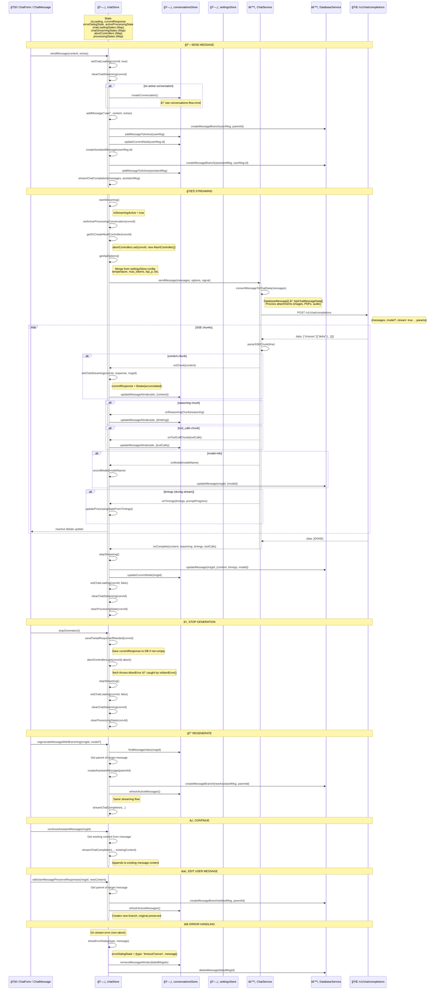

```mermaid
sequenceDiagram
    participant UI as 🧩 ChatForm / ChatMessage
    participant chatStore as ğŸ—„ï¸ chatStore
    participant convStore as ğŸ—„ï¸ conversationsStore
    participant settingsStore as ğŸ—„ï¸ settingsStore
    participant ChatSvc as âš™ï¸ ChatService
    participant DbSvc as âš™ï¸ DatabaseService
    participant API as 🌠/v1/chat/completions

    Note over chatStore: State:<br/>isLoading, currentResponse<br/>errorDialogState, activeProcessingState<br/>chatLoadingStates (Map)<br/>chatStreamingStates (Map)<br/>abortControllers (Map)<br/>processingStates (Map)

    %% â•â•â•â•â•â•â•â•â•â•â•â•â•â•â•â•â•â•â•â•â•â•â•â•â•â•â•â•â•â•â•â•â•â•â•â•â•â•â•â•â•â•â•â•â•â•â•â•â•â•â•â•â•â•â•â•â•â•â•â•â•â•â•â•â•â•â•â•â•â•â•â•â•â•â•
    Note over UI,API: 💬 SEND MESSAGE
    %% â•â•â•â•â•â•â•â•â•â•â•â•â•â•â•â•â•â•â•â•â•â•â•â•â•â•â•â•â•â•â•â•â•â•â•â•â•â•â•â•â•â•â•â•â•â•â•â•â•â•â•â•â•â•â•â•â•â•â•â•â•â•â•â•â•â•â•â•â•â•â•â•â•â•â•

    UI->>chatStore: sendMessage(content, extras)
    activate chatStore

    chatStore->>chatStore: setChatLoading(convId, true)
    chatStore->>chatStore: clearChatStreaming(convId)

    alt no active conversation
        chatStore->>convStore: createConversation()
        Note over convStore: → see conversations-flow.mmd
    end

    chatStore->>chatStore: addMessage("user", content, extras)
    chatStore->>DbSvc: createMessageBranch(userMsg, parentId)
    chatStore->>convStore: addMessageToActive(userMsg)
    chatStore->>convStore: updateCurrentNode(userMsg.id)

    chatStore->>chatStore: createAssistantMessage(userMsg.id)
    chatStore->>DbSvc: createMessageBranch(assistantMsg, userMsg.id)
    chatStore->>convStore: addMessageToActive(assistantMsg)

    chatStore->>chatStore: streamChatCompletion(messages, assistantMsg)
    deactivate chatStore

    %% â•â•â•â•â•â•â•â•â•â•â•â•â•â•â•â•â•â•â•â•â•â•â•â•â•â•â•â•â•â•â•â•â•â•â•â•â•â•â•â•â•â•â•â•â•â•â•â•â•â•â•â•â•â•â•â•â•â•â•â•â•â•â•â•â•â•â•â•â•â•â•â•â•â•â•
    Note over UI,API: 🌊 STREAMING
    %% â•â•â•â•â•â•â•â•â•â•â•â•â•â•â•â•â•â•â•â•â•â•â•â•â•â•â•â•â•â•â•â•â•â•â•â•â•â•â•â•â•â•â•â•â•â•â•â•â•â•â•â•â•â•â•â•â•â•â•â•â•â•â•â•â•â•â•â•â•â•â•â•â•â•â•

    activate chatStore
    chatStore->>chatStore: startStreaming()
    Note right of chatStore: isStreamingActive = true

    chatStore->>chatStore: setActiveProcessingConversation(convId)
    chatStore->>chatStore: getOrCreateAbortController(convId)
    Note right of chatStore: abortControllers.set(convId, new AbortController())

    chatStore->>chatStore: getApiOptions()
    Note right of chatStore: Merge from settingsStore.config:<br/>temperature, max_tokens, top_p, etc.

    chatStore->>ChatSvc: sendMessage(messages, options, signal)
    activate ChatSvc

    ChatSvc->>ChatSvc: convertMessageToChatData(messages)
    Note right of ChatSvc: DatabaseMessage[] → ApiChatMessageData[]<br/>Process attachments (images, PDFs, audio)

    ChatSvc->>API: POST /v1/chat/completions
    Note right of API: {messages, model?, stream: true, ...params}

    loop SSE chunks
        API-->>ChatSvc: data: {"choices":[{"delta":{...}}]}
        ChatSvc->>ChatSvc: parseSSEChunk(line)

        alt content chunk
            ChatSvc-->>chatStore: onChunk(content)
            chatStore->>chatStore: setChatStreaming(convId, response, msgId)
            Note right of chatStore: currentResponse = $state(accumulated)
            chatStore->>convStore: updateMessageAtIndex(idx, {content})
        end

        alt reasoning chunk
            ChatSvc-->>chatStore: onReasoningChunk(reasoning)
            chatStore->>convStore: updateMessageAtIndex(idx, {thinking})
        end

        alt tool_calls chunk
            ChatSvc-->>chatStore: onToolCallChunk(toolCalls)
            chatStore->>convStore: updateMessageAtIndex(idx, {toolCalls})
        end

        alt model info
            ChatSvc-->>chatStore: onModel(modelName)
            chatStore->>chatStore: recordModel(modelName)
            chatStore->>DbSvc: updateMessage(msgId, {model})
        end

        alt timings (during stream)
            ChatSvc-->>chatStore: onTimings(timings, promptProgress)
            chatStore->>chatStore: updateProcessingStateFromTimings()
        end

        chatStore-->>UI: reactive $state update
    end

    API-->>ChatSvc: data: [DONE]
    ChatSvc-->>chatStore: onComplete(content, reasoning, timings, toolCalls)
    deactivate ChatSvc

    chatStore->>chatStore: stopStreaming()
    chatStore->>DbSvc: updateMessage(msgId, {content, timings, model})
    chatStore->>convStore: updateCurrentNode(msgId)
    chatStore->>chatStore: setChatLoading(convId, false)
    chatStore->>chatStore: clearChatStreaming(convId)
    chatStore->>chatStore: clearProcessingState(convId)
    deactivate chatStore

    %% â•â•â•â•â•â•â•â•â•â•â•â•â•â•â•â•â•â•â•â•â•â•â•â•â•â•â•â•â•â•â•â•â•â•â•â•â•â•â•â•â•â•â•â•â•â•â•â•â•â•â•â•â•â•â•â•â•â•â•â•â•â•â•â•â•â•â•â•â•â•â•â•â•â•â•
    Note over UI,API: â¹ï¸ STOP GENERATION
    %% â•â•â•â•â•â•â•â•â•â•â•â•â•â•â•â•â•â•â•â•â•â•â•â•â•â•â•â•â•â•â•â•â•â•â•â•â•â•â•â•â•â•â•â•â•â•â•â•â•â•â•â•â•â•â•â•â•â•â•â•â•â•â•â•â•â•â•â•â•â•â•â•â•â•â•

    UI->>chatStore: stopGeneration()
    activate chatStore
    chatStore->>chatStore: savePartialResponseIfNeeded(convId)
    Note right of chatStore: Save currentResponse to DB if non-empty
    chatStore->>chatStore: abortControllers.get(convId).abort()
    Note right of chatStore: fetch throws AbortError → caught by isAbortError()
    chatStore->>chatStore: stopStreaming()
    chatStore->>chatStore: setChatLoading(convId, false)
    chatStore->>chatStore: clearChatStreaming(convId)
    chatStore->>chatStore: clearProcessingState(convId)
    deactivate chatStore

    %% â•â•â•â•â•â•â•â•â•â•â•â•â•â•â•â•â•â•â•â•â•â•â•â•â•â•â•â•â•â•â•â•â•â•â•â•â•â•â•â•â•â•â•â•â•â•â•â•â•â•â•â•â•â•â•â•â•â•â•â•â•â•â•â•â•â•â•â•â•â•â•â•â•â•â•
    Note over UI,API: 🔠REGENERATE
    %% â•â•â•â•â•â•â•â•â•â•â•â•â•â•â•â•â•â•â•â•â•â•â•â•â•â•â•â•â•â•â•â•â•â•â•â•â•â•â•â•â•â•â•â•â•â•â•â•â•â•â•â•â•â•â•â•â•â•â•â•â•â•â•â•â•â•â•â•â•â•â•â•â•â•â•

    UI->>chatStore: regenerateMessageWithBranching(msgId, model?)
    activate chatStore
    chatStore->>convStore: findMessageIndex(msgId)
    chatStore->>chatStore: Get parent of target message
    chatStore->>chatStore: createAssistantMessage(parentId)
    chatStore->>DbSvc: createMessageBranch(newAssistantMsg, parentId)
    chatStore->>convStore: refreshActiveMessages()
    Note right of chatStore: Same streaming flow
    chatStore->>chatStore: streamChatCompletion(...)
    deactivate chatStore

    %% â•â•â•â•â•â•â•â•â•â•â•â•â•â•â•â•â•â•â•â•â•â•â•â•â•â•â•â•â•â•â•â•â•â•â•â•â•â•â•â•â•â•â•â•â•â•â•â•â•â•â•â•â•â•â•â•â•â•â•â•â•â•â•â•â•â•â•â•â•â•â•â•â•â•â•
    Note over UI,API: â¡ï¸ CONTINUE
    %% â•â•â•â•â•â•â•â•â•â•â•â•â•â•â•â•â•â•â•â•â•â•â•â•â•â•â•â•â•â•â•â•â•â•â•â•â•â•â•â•â•â•â•â•â•â•â•â•â•â•â•â•â•â•â•â•â•â•â•â•â•â•â•â•â•â•â•â•â•â•â•â•â•â•â•

    UI->>chatStore: continueAssistantMessage(msgId)
    activate chatStore
    chatStore->>chatStore: Get existing content from message
    chatStore->>chatStore: streamChatCompletion(..., existingContent)
    Note right of chatStore: Appends to existing message content
    deactivate chatStore

    %% â•â•â•â•â•â•â•â•â•â•â•â•â•â•â•â•â•â•â•â•â•â•â•â•â•â•â•â•â•â•â•â•â•â•â•â•â•â•â•â•â•â•â•â•â•â•â•â•â•â•â•â•â•â•â•â•â•â•â•â•â•â•â•â•â•â•â•â•â•â•â•â•â•â•â•
    Note over UI,API: âœï¸ EDIT USER MESSAGE
    %% â•â•â•â•â•â•â•â•â•â•â•â•â•â•â•â•â•â•â•â•â•â•â•â•â•â•â•â•â•â•â•â•â•â•â•â•â•â•â•â•â•â•â•â•â•â•â•â•â•â•â•â•â•â•â•â•â•â•â•â•â•â•â•â•â•â•â•â•â•â•â•â•â•â•â•

    UI->>chatStore: editUserMessagePreserveResponses(msgId, newContent)
    activate chatStore
    chatStore->>chatStore: Get parent of target message
    chatStore->>DbSvc: createMessageBranch(editedMsg, parentId)
    chatStore->>convStore: refreshActiveMessages()
    Note right of chatStore: Creates new branch, original preserved
    deactivate chatStore

    %% â•â•â•â•â•â•â•â•â•â•â•â•â•â•â•â•â•â•â•â•â•â•â•â•â•â•â•â•â•â•â•â•â•â•â•â•â•â•â•â•â•â•â•â•â•â•â•â•â•â•â•â•â•â•â•â•â•â•â•â•â•â•â•â•â•â•â•â•â•â•â•â•â•â•â•
    Note over UI,API: ⌠ERROR HANDLING
    %% â•â•â•â•â•â•â•â•â•â•â•â•â•â•â•â•â•â•â•â•â•â•â•â•â•â•â•â•â•â•â•â•â•â•â•â•â•â•â•â•â•â•â•â•â•â•â•â•â•â•â•â•â•â•â•â•â•â•â•â•â•â•â•â•â•â•â•â•â•â•â•â•â•â•â•

    Note over chatStore: On stream error (non-abort):
    chatStore->>chatStore: showErrorDialog(type, message)
    Note right of chatStore: errorDialogState = {type: 'timeout'|'server', message}
    chatStore->>convStore: removeMessageAtIndex(failedMsgIdx)
    chatStore->>DbSvc: deleteMessage(failedMsgId)
```
