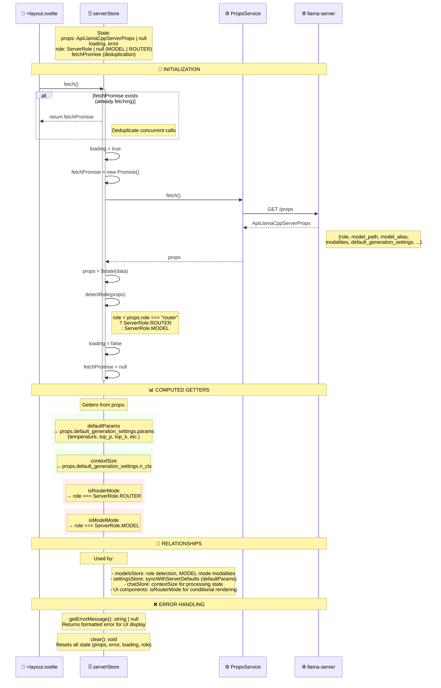

```mermaid
sequenceDiagram
    participant UI as 🧩 +layout.svelte
    participant serverStore as 🗄️ serverStore
    participant PropsSvc as ⚙️ PropsService
    participant API as 🌐 llama-server

    Note over serverStore: State:<br/>props: ApiLlamaCppServerProps | null<br/>loading, error<br/>role: ServerRole | null (MODEL | ROUTER)<br/>fetchPromise (deduplication)

    %% ═══════════════════════════════════════════════════════════════════════════
    Note over UI,API: 🚀 INITIALIZATION
    %% ═══════════════════════════════════════════════════════════════════════════

    UI->>serverStore: fetch()
    activate serverStore

    alt fetchPromise exists (already fetching)
        serverStore-->>UI: return fetchPromise
        Note right of serverStore: Deduplicate concurrent calls
    end

    serverStore->>serverStore: loading = true
    serverStore->>serverStore: fetchPromise = new Promise()

    serverStore->>PropsSvc: fetch()
    PropsSvc->>API: GET /props
    API-->>PropsSvc: ApiLlamaCppServerProps
    Note right of API: {role, model_path, model_alias,<br/>modalities, default_generation_settings, ...}

    PropsSvc-->>serverStore: props
    serverStore->>serverStore: props = $state(data)

    serverStore->>serverStore: detectRole(props)
    Note right of serverStore: role = props.role === "router"<br/>  ? ServerRole.ROUTER<br/>  : ServerRole.MODEL

    serverStore->>serverStore: loading = false
    serverStore->>serverStore: fetchPromise = null
    deactivate serverStore

    %% ═══════════════════════════════════════════════════════════════════════════
    Note over UI,API: 📊 COMPUTED GETTERS
    %% ═══════════════════════════════════════════════════════════════════════════

    Note over serverStore: Getters from props:

    rect rgb(240, 255, 240)
        Note over serverStore: defaultParams<br/>→ props.default_generation_settings.params<br/>(temperature, top_p, top_k, etc.)
    end

    rect rgb(240, 255, 240)
        Note over serverStore: contextSize<br/>→ props.default_generation_settings.n_ctx
    end

    rect rgb(255, 240, 240)
        Note over serverStore: isRouterMode<br/>→ role === ServerRole.ROUTER
    end

    rect rgb(255, 240, 240)
        Note over serverStore: isModelMode<br/>→ role === ServerRole.MODEL
    end

    %% ═══════════════════════════════════════════════════════════════════════════
    Note over UI,API: 🔗 RELATIONSHIPS
    %% ═══════════════════════════════════════════════════════════════════════════

    Note over serverStore: Used by:
    Note right of serverStore: - modelsStore: role detection, MODEL mode modalities<br/>- settingsStore: syncWithServerDefaults (defaultParams)<br/>- chatStore: contextSize for processing state<br/>- UI components: isRouterMode for conditional rendering

    %% ═══════════════════════════════════════════════════════════════════════════
    Note over UI,API: ❌ ERROR HANDLING
    %% ═══════════════════════════════════════════════════════════════════════════

    Note over serverStore: getErrorMessage(): string | null<br/>Returns formatted error for UI display

    Note over serverStore: clear(): void<br/>Resets all state (props, error, loading, role)
```
