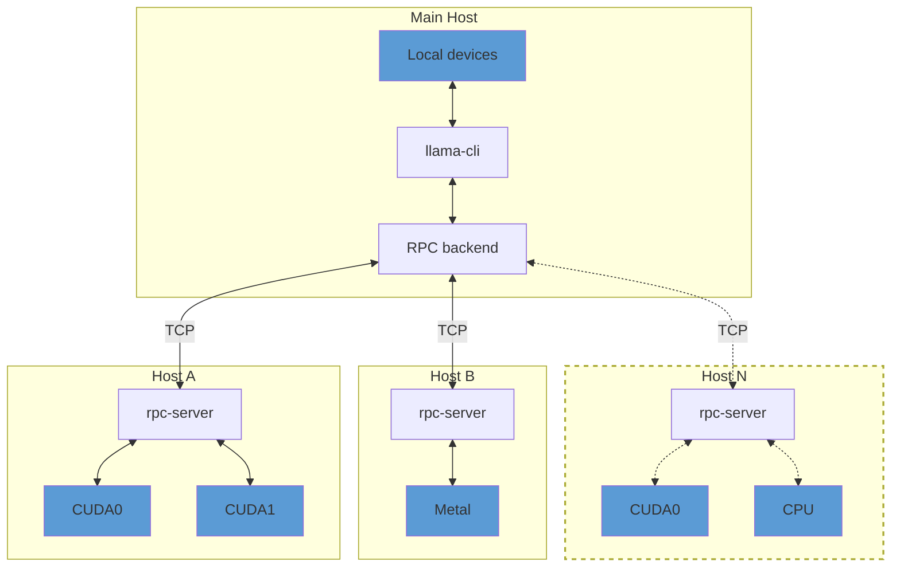

## Overview

> [!IMPORTANT]
> This example and the RPC backend are currently in a proof-of-concept development stage. As such, the functionality is fragile and
> insecure. **Never run the RPC server on an open network or in a sensitive environment!**

The `rpc-server` allows exposing `ggml` devices on a remote host.
The RPC backend communicates with one or several instances of `rpc-server` and offloads computations to them.
This can be used for distributed LLM inference with `llama.cpp` in the following way:



By default, `rpc-server` exposes all available accelerator devices on the host.
If there are no accelerators, it exposes a single `CPU` device.

## Usage

### Remote hosts

On each remote host, build the backends for each accelerator by adding `-DGGML_RPC=ON` to the build options.
For example, to build the `rpc-server` with support for CUDA accelerators:

```bash
mkdir build-rpc-cuda
cd build-rpc-cuda
cmake .. -DGGML_CUDA=ON -DGGML_RPC=ON
cmake --build . --config Release
```

When started, the `rpc-server` will detect and expose all available `CUDA` devices:

```bash
$ bin/rpc-server
ggml_cuda_init: GGML_CUDA_FORCE_MMQ:    no
ggml_cuda_init: GGML_CUDA_FORCE_CUBLAS: no
ggml_cuda_init: found 1 CUDA devices:
  Device 0: NVIDIA GeForce RTX 5090, compute capability 12.0, VMM: yes
Starting RPC server v3.0.0
  endpoint       : 127.0.0.1:50052
  local cache    : n/a
Devices:
  CUDA0: NVIDIA GeForce RTX 5090 (32109 MiB, 31588 MiB free)
```

You can control the set of exposed CUDA devices with the `CUDA_VISIBLE_DEVICES` environment variable or the `--device` command line option. The following two commands have the same effect:
```bash
$ CUDA_VISIBLE_DEVICES=0 bin/rpc-server -p 50052
$ bin/rpc-server --device CUDA0 -p 50052
```

### Main host

On the main host build `llama.cpp` with the backends for the local devices and add `-DGGML_RPC=ON` to the build options.
Finally, when running `llama-cli` or `llama-server`, use the `--rpc` option to specify the host and port of each `rpc-server`:

```bash
$ llama-cli -hf ggml-org/gemma-3-1b-it-GGUF -ngl 99 --rpc 192.168.88.10:50052,192.168.88.11:50052
```

By default, llama.cpp distributes model weights and the KV cache across all available devices -- both local and remote -- in proportion to each device's available memory.
You can override this behavior with the `--tensor-split` option and set custom proportions when splitting tensor data across devices.

### Local cache

The RPC server can use a local cache to store large tensors and avoid transferring them over the network.
This can speed up model loading significantly, especially when using large models.
To enable the cache, use the `-c` option:

```bash
$ bin/rpc-server -c
```

By default, the cache is stored in the `$HOME/.cache/llama.cpp/rpc` directory and can be controlled via the `LLAMA_CACHE` environment variable.

### Troubleshooting

Use the `GGML_RPC_DEBUG` environment variable to enable debug messages from `rpc-server`:
```bash
$ GGML_RPC_DEBUG=1 bin/rpc-server
```

