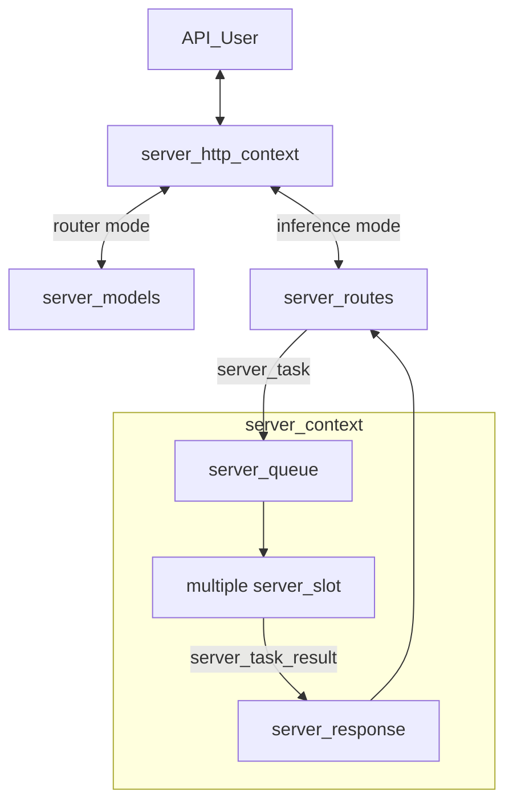

# llama-server Development Documentation

This document provides an in-depth technical overview of `llama-server`, intended for maintainers and contributors.

If you are an end user consuming `llama-server` as a product, please refer to the main [README](./README.md) instead.

## Backend

### Overview

The server supports two primary operating modes:

- **Inference mode**: The default mode for performing inference with a single loaded GGUF model.
- **Router mode**: Enables management of multiple inference server instances behind a single API endpoint. Requests are automatically routed to the appropriate backend instance based on the requested model.

The core architecture consists of the following components:

- `server_context`: Holds the primary inference state, including the main `llama_context` and all active slots.
- `server_slot`: An abstraction over a single “sequence” in llama.cpp, responsible for managing individual parallel inference requests.
- `server_routes`: Middleware layer between `server_context` and the HTTP interface; handles JSON parsing/formatting and request routing logic.
- `server_http_context`: Implements the HTTP server using `cpp-httplib`.
- `server_queue`: Thread-safe queue used by HTTP workers to submit new tasks to `server_context`.
- `server_response`: Thread-safe queue used by `server_context` to return results to HTTP workers.
- `server_response_reader`: Higher-level wrapper around the two queues above for cleaner code.
- `server_task`: Unit of work pushed into `server_queue`.
- `server_task_result`: Unit of result pushed into `server_response`.
- `server_tokens`: Unified representation of token sequences (supports both text and multimodal tokens); used by `server_task` and `server_slot`.
- `server_prompt_checkpoint`: For recurrent (e.g., RWKV) and SWA models, stores snapshots of KV cache state. Enables reuse when subsequent requests share the same prompt prefix, saving redundant computation.
- `server_models`: Standalone component for managing multiple backend instances (used in router mode). It is completely independent of `server_context`.



### Batching

The server context maintains a single batch shared across all slots. When `update_slots()` is invoked, the system iterates through all active slots to populate this batch. For each slot, either a generated token from the previous decoding step or available prompt tokens are added to the batch.

Batching constraints apply: slots can only be batched together if they share compatible configurations. For instance, slots using a specific LoRA adapter can be batched with each other, but not with slots using a different LoRA adapter or no adapter at all.

Once the batch reaches capacity or all slots have been processed, `llama_decode` is called to execute the inference. This operation represents the primary computational bottleneck in `update_slots()`.

Following decoding, the system either retrieves embeddings or samples the next token using `common_sampler_sample`. If a slot has remaining prompt tokens to process, it yields until the next `update_slots()` iteration.

### Thread Management

`server_context` runs on a dedicated single thread. Because it is single-threaded, heavy post-processing (especially after token generation) should be avoided, as it directly impacts multi-sequence throughput.

Each incoming HTTP request is handled by its own thread managed by the HTTP library. The following operations are performed in HTTP worker threads:

- JSON request parsing
- Chat template application
- Tokenization
- Conversion of `server_task_result` into final JSON response
- Error formatting into JSON
- Tracking of partial/incremental responses (e.g., streaming tool calls or reasoning steps)

**Best practices to follow:**

- All JSON formatting and chat template logic must stay in the HTTP layer.
- Avoid passing raw JSON between the HTTP layer and `server_slot`. Instead, parse everything into native C++ types as early as possible.

### Example trace of a request

Here is an example trace of an API request for text completion:

- A request arrives at the HTTP layer.
- The request is routed to the corresponding handler inside `server_routes`. In this case, `handle_completions_impl` is invoked.
- The handler parses the input request, constructs a new `server_task`, and passes it to `server_res_generator`.
- `server_res_generator` creates a new `task_result_state` for each task:
    - `task_result_state` stays in the HTTP layer, responsible for keeping track of the current state of the response (e.g., parsing tool calls or thinking messages).
    - `server_task` is moved into `server_queue` inside `server_context`.
- `server_context` launches the task by moving it into an available slot (see `launch_slot_with_task()`).
- `update_slot()` processes the task as described in the "Batching" section above.
- Results may be sent using `send_partial_response` or `send_final_response`, which creates a new `server_task_result` and pushes it to the response queue.
- At the same time, `server_res_generator` listens to the response queue and retrieves this response.
- As the response is stateless, `server_res_generator` calls `response->update()` to update the response with the current state.
- `server_res_generator` then calls `response->to_json()` and passes the response to the HTTP layer.

### Testing

`llama-server` includes an automated test suite based on `pytest`.

The framework automatically starts a `llama-server` instance, sends requests, and validates responses.

For detailed instructions, see the [test documentation](./tests/README.md).

### Notable Related PRs

- Initial server implementation: https://github.com/ggml-org/llama.cpp/pull/1443
- Parallel decoding support: https://github.com/ggml-org/llama.cpp/pull/3228
- Refactor introducing `server_queue` and `server_response`: https://github.com/ggml-org/llama.cpp/pull/5065
- Reranking endpoint: https://github.com/ggml-org/llama.cpp/pull/9510
- Multimodal model support (`libmtmd`): https://github.com/ggml-org/llama.cpp/pull/12898
- Unified KV cache handling: https://github.com/ggml-org/llama.cpp/pull/16736
- Separation of HTTP logic into dedicated files: https://github.com/ggml-org/llama.cpp/pull/17216
- Large-scale code base split into smaller files: https://github.com/ggml-org/llama.cpp/pull/17362
- Introduction of router mode: https://github.com/ggml-org/llama.cpp/pull/17470
- Speculative decoding: https://github.com/ggml-org/llama.cpp/pull/17808 and rework in https://github.com/ggml-org/llama.cpp/pull/17808
- INI presets: https://github.com/ggml-org/llama.cpp/pull/17859 (+ refactoring: https://github.com/ggml-org/llama.cpp/pull/18169)
- Sleeping mode: https://github.com/ggml-org/llama.cpp/pull/18228


## Web UI

The project includes a web-based user interface for interacting with `llama-server`. It supports both single-model (`MODEL` mode) and multi-model (`ROUTER` mode) operation.

The SvelteKit-based Web UI is introduced in this PR: https://github.com/ggml-org/llama.cpp/pull/14839

### Features

-   **Chat interface** with streaming responses
-   **Multi-model support** (ROUTER mode) - switch between models, auto-load on selection
-   **Modality validation** - ensures selected model supports conversation's attachments (images, audio)
-   **Conversation management** - branching, regeneration, editing with history preservation
-   **Attachment support** - images, audio, PDFs (with vision/text fallback)
-   **Configurable parameters** - temperature, top_p, etc. synced with server defaults
-   **Dark/light theme**

### Tech Stack

-   **SvelteKit** - frontend framework with Svelte 5 runes for reactive state
-   **TailwindCSS** + **shadcn-svelte** - styling and UI components
-   **Vite** - build tooling
-   **IndexedDB** (Dexie) - local storage for conversations
-   **LocalStorage** - user settings persistence

### Architecture

The WebUI follows a layered architecture:

```
Routes → Components → Hooks → Stores → Services → Storage/API
```

-   **Stores** - reactive state management (`chatStore`, `conversationsStore`, `modelsStore`, `serverStore`, `settingsStore`)
-   **Services** - stateless API/database communication (`ChatService`, `ModelsService`, `PropsService`, `DatabaseService`)
-   **Hooks** - reusable logic (`useModelChangeValidation`, `useProcessingState`)

For detailed architecture diagrams, see [`tools/server/webui/docs/`](webui/docs/):

-   `high-level-architecture.mmd` - full architecture with all modules
-   `high-level-architecture-simplified.mmd` - simplified overview
-   `data-flow-simplified-model-mode.mmd` - data flow for single-model mode
-   `data-flow-simplified-router-mode.mmd` - data flow for multi-model mode
-   `flows/*.mmd` - detailed per-domain flows (chat, conversations, models, etc.)

### Development

```sh
# make sure you have Node.js installed
cd tools/server/webui
npm i

# run dev server (with hot reload)
npm run dev

# run tests
npm run test

# build production bundle
npm run build
```

After `public/index.html.gz` has been generated, rebuild `llama-server` as described in the [build](#build) section to include the updated UI.

**Note:** The Vite dev server automatically proxies API requests to `http://localhost:8080`. Make sure `llama-server` is running on that port during development.
