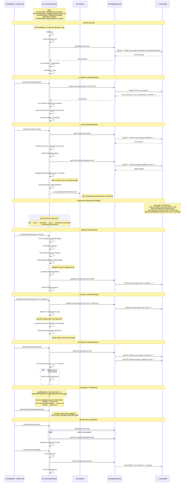

```mermaid
sequenceDiagram
    participant UI as 🧩 ChatSidebar / ChatScreen
    participant convStore as 🗄️ conversationsStore
    participant chatStore as 🗄️ chatStore
    participant DbSvc as ⚙️ DatabaseService
    participant IDB as 💾 IndexedDB

    Note over convStore: State:<br/>conversations: DatabaseConversation[]<br/>activeConversation: DatabaseConversation | null<br/>activeMessages: DatabaseMessage[]<br/>isInitialized: boolean<br/>usedModalities: $derived({vision, audio})

    %% ═══════════════════════════════════════════════════════════════════════════
    Note over UI,IDB: 🚀 INITIALIZATION
    %% ═══════════════════════════════════════════════════════════════════════════

    Note over convStore: Auto-initialized in constructor (browser only)
    convStore->>convStore: initialize()
    activate convStore
    convStore->>convStore: loadConversations()
    convStore->>DbSvc: getAllConversations()
    DbSvc->>IDB: SELECT * FROM conversations ORDER BY lastModified DESC
    IDB-->>DbSvc: Conversation[]
    DbSvc-->>convStore: conversations
    convStore->>convStore: conversations = $state(data)
    convStore->>convStore: isInitialized = true
    deactivate convStore

    %% ═══════════════════════════════════════════════════════════════════════════
    Note over UI,IDB: ➕ CREATE CONVERSATION
    %% ═══════════════════════════════════════════════════════════════════════════

    UI->>convStore: createConversation(name?)
    activate convStore
    convStore->>DbSvc: createConversation(name || "New Chat")
    DbSvc->>IDB: INSERT INTO conversations
    IDB-->>DbSvc: conversation {id, name, lastModified, currNode: ""}
    DbSvc-->>convStore: conversation
    convStore->>convStore: conversations.unshift(conversation)
    convStore->>convStore: activeConversation = $state(conversation)
    convStore->>convStore: activeMessages = $state([])
    deactivate convStore

    %% ═══════════════════════════════════════════════════════════════════════════
    Note over UI,IDB: 📂 LOAD CONVERSATION
    %% ═══════════════════════════════════════════════════════════════════════════

    UI->>convStore: loadConversation(convId)
    activate convStore
    convStore->>DbSvc: getConversation(convId)
    DbSvc->>IDB: SELECT * FROM conversations WHERE id = ?
    IDB-->>DbSvc: conversation
    convStore->>convStore: activeConversation = $state(conversation)

    convStore->>convStore: refreshActiveMessages()
    convStore->>DbSvc: getConversationMessages(convId)
    DbSvc->>IDB: SELECT * FROM messages WHERE convId = ?
    IDB-->>DbSvc: allMessages[]
    convStore->>convStore: filterByLeafNodeId(allMessages, currNode)
    Note right of convStore: Filter to show only current branch path
    convStore->>convStore: activeMessages = $state(filtered)

    convStore->>chatStore: syncLoadingStateForChat(convId)
    Note right of chatStore: Sync isLoading/currentResponse if streaming
    deactivate convStore

    %% ═══════════════════════════════════════════════════════════════════════════
    Note over UI,IDB: 🌳 MESSAGE BRANCHING MODEL
    %% ═══════════════════════════════════════════════════════════════════════════

    Note over IDB: Message Tree Structure:<br/>- Each message has parent (null for root)<br/>- Each message has children[] array<br/>- Conversation.currNode points to active leaf<br/>- filterByLeafNodeId() traverses from root to currNode

    rect rgb(240, 240, 255)
        Note over convStore: Example Branch Structure:
        Note over convStore: root → user1 → assistant1 → user2 → assistant2a (currNode)<br/>                                    ↘ assistant2b (alt branch)
    end

    %% ═══════════════════════════════════════════════════════════════════════════
    Note over UI,IDB: ↔️ BRANCH NAVIGATION
    %% ═══════════════════════════════════════════════════════════════════════════

    UI->>convStore: navigateToSibling(msgId, direction)
    activate convStore
    convStore->>convStore: Find message in activeMessages
    convStore->>convStore: Get parent message
    convStore->>convStore: Find sibling in parent.children[]
    convStore->>convStore: findLeafNode(siblingId, allMessages)
    Note right of convStore: Navigate to leaf of sibling branch
    convStore->>convStore: updateCurrentNode(leafId)
    convStore->>DbSvc: updateCurrentNode(convId, leafId)
    DbSvc->>IDB: UPDATE conversations SET currNode = ?
    convStore->>convStore: refreshActiveMessages()
    deactivate convStore

    %% ═══════════════════════════════════════════════════════════════════════════
    Note over UI,IDB: 📝 UPDATE CONVERSATION
    %% ═══════════════════════════════════════════════════════════════════════════

    UI->>convStore: updateConversationName(convId, newName)
    activate convStore
    convStore->>DbSvc: updateConversation(convId, {name: newName})
    DbSvc->>IDB: UPDATE conversations SET name = ?
    convStore->>convStore: Update in conversations array
    deactivate convStore

    Note over convStore: Auto-title update (after first response):
    convStore->>convStore: updateConversationTitleWithConfirmation()
    convStore->>convStore: titleUpdateConfirmationCallback?()
    Note right of convStore: Shows dialog if title would change

    %% ═══════════════════════════════════════════════════════════════════════════
    Note over UI,IDB: 🗑️ DELETE CONVERSATION
    %% ═══════════════════════════════════════════════════════════════════════════

    UI->>convStore: deleteConversation(convId)
    activate convStore
    convStore->>DbSvc: deleteConversation(convId)
    DbSvc->>IDB: DELETE FROM conversations WHERE id = ?
    DbSvc->>IDB: DELETE FROM messages WHERE convId = ?
    convStore->>convStore: conversations.filter(c => c.id !== convId)
    alt deleted active conversation
        convStore->>convStore: clearActiveConversation()
    end
    deactivate convStore

    %% ═══════════════════════════════════════════════════════════════════════════
    Note over UI,IDB: 📊 MODALITY TRACKING
    %% ═══════════════════════════════════════════════════════════════════════════

    Note over convStore: usedModalities = $derived.by(() => {<br/>  calculateModalitiesFromMessages(activeMessages)<br/>})

    Note over convStore: Scans activeMessages for attachments:<br/>- IMAGE → vision: true<br/>- PDF (processedAsImages) → vision: true<br/>- AUDIO → audio: true

    UI->>convStore: getModalitiesUpToMessage(msgId)
    Note right of convStore: Used for regeneration validation<br/>Only checks messages BEFORE target

    %% ═══════════════════════════════════════════════════════════════════════════
    Note over UI,IDB: 📤 EXPORT / 📥 IMPORT
    %% ═══════════════════════════════════════════════════════════════════════════

    UI->>convStore: exportAllConversations()
    activate convStore
    convStore->>DbSvc: getAllConversations()
    loop each conversation
        convStore->>DbSvc: getConversationMessages(convId)
    end
    convStore->>convStore: triggerDownload(JSON blob)
    deactivate convStore

    UI->>convStore: importConversations(file)
    activate convStore
    convStore->>convStore: Parse JSON file
    convStore->>DbSvc: importConversations(parsed)
    DbSvc->>IDB: Bulk INSERT conversations + messages
    convStore->>convStore: loadConversations()
    deactivate convStore
```
