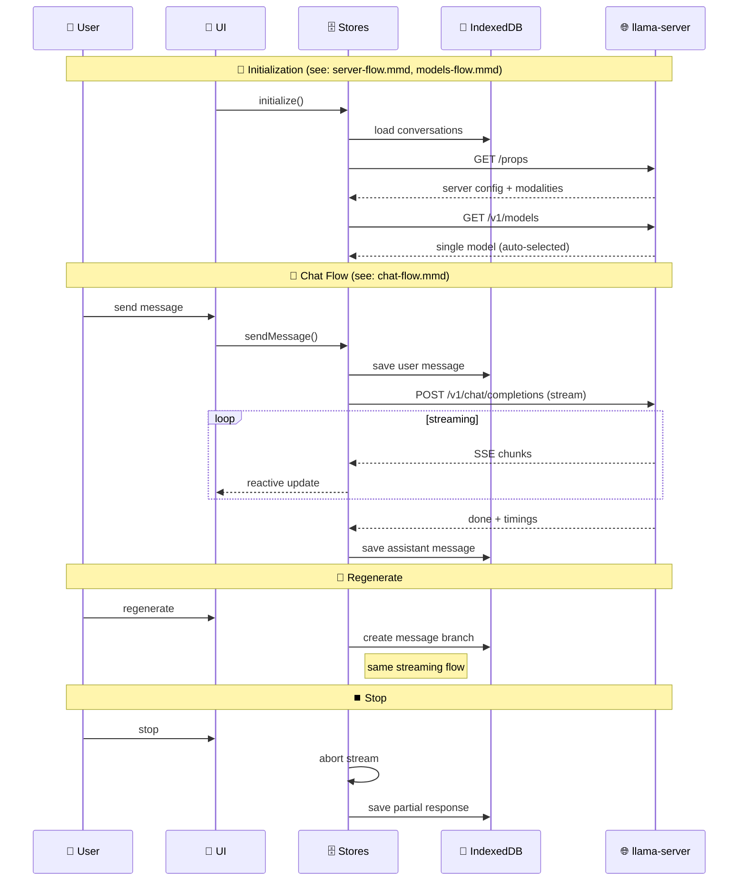

```mermaid
%% MODEL Mode Data Flow (single model)
%% Detailed flows: ./flows/server-flow.mmd, ./flows/models-flow.mmd, ./flows/chat-flow.mmd

sequenceDiagram
    participant User as 👤 User
    participant UI as 🧩 UI
    participant Stores as 🗄️ Stores
    participant DB as 💾 IndexedDB
    participant API as 🌐 llama-server

    Note over User,API: 🚀 Initialization (see: server-flow.mmd, models-flow.mmd)

    UI->>Stores: initialize()
    Stores->>DB: load conversations
    Stores->>API: GET /props
    API-->>Stores: server config + modalities
    Stores->>API: GET /v1/models
    API-->>Stores: single model (auto-selected)

    Note over User,API: 💬 Chat Flow (see: chat-flow.mmd)

    User->>UI: send message
    UI->>Stores: sendMessage()
    Stores->>DB: save user message
    Stores->>API: POST /v1/chat/completions (stream)
    loop streaming
        API-->>Stores: SSE chunks
        Stores-->>UI: reactive update
    end
    API-->>Stores: done + timings
    Stores->>DB: save assistant message

    Note over User,API: 🔁 Regenerate

    User->>UI: regenerate
    Stores->>DB: create message branch
    Note right of Stores: same streaming flow

    Note over User,API: ⏹️ Stop

    User->>UI: stop
    Stores->>Stores: abort stream
    Stores->>DB: save partial response
```
