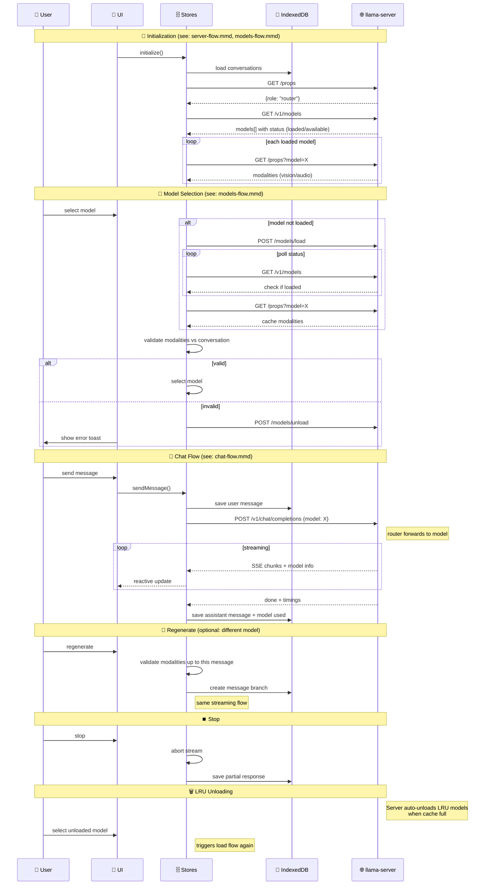

```mermaid
%% ROUTER Mode Data Flow (multi-model)
%% Detailed flows: ./flows/server-flow.mmd, ./flows/models-flow.mmd, ./flows/chat-flow.mmd

sequenceDiagram
    participant User as 👤 User
    participant UI as 🧩 UI
    participant Stores as 🗄️ Stores
    participant DB as 💾 IndexedDB
    participant API as 🌐 llama-server

    Note over User,API: 🚀 Initialization (see: server-flow.mmd, models-flow.mmd)

    UI->>Stores: initialize()
    Stores->>DB: load conversations
    Stores->>API: GET /props
    API-->>Stores: {role: "router"}
    Stores->>API: GET /v1/models
    API-->>Stores: models[] with status (loaded/available)
    loop each loaded model
        Stores->>API: GET /props?model=X
        API-->>Stores: modalities (vision/audio)
    end

    Note over User,API: 🔄 Model Selection (see: models-flow.mmd)

    User->>UI: select model
    alt model not loaded
        Stores->>API: POST /models/load
        loop poll status
            Stores->>API: GET /v1/models
            API-->>Stores: check if loaded
        end
        Stores->>API: GET /props?model=X
        API-->>Stores: cache modalities
    end
    Stores->>Stores: validate modalities vs conversation
    alt valid
        Stores->>Stores: select model
    else invalid
        Stores->>API: POST /models/unload
        UI->>User: show error toast
    end

    Note over User,API: 💬 Chat Flow (see: chat-flow.mmd)

    User->>UI: send message
    UI->>Stores: sendMessage()
    Stores->>DB: save user message
    Stores->>API: POST /v1/chat/completions {model: X}
    Note right of API: router forwards to model
    loop streaming
        API-->>Stores: SSE chunks + model info
        Stores-->>UI: reactive update
    end
    API-->>Stores: done + timings
    Stores->>DB: save assistant message + model used

    Note over User,API: 🔁 Regenerate (optional: different model)

    User->>UI: regenerate
    Stores->>Stores: validate modalities up to this message
    Stores->>DB: create message branch
    Note right of Stores: same streaming flow

    Note over User,API: ⏹️ Stop

    User->>UI: stop
    Stores->>Stores: abort stream
    Stores->>DB: save partial response

    Note over User,API: 🗑️ LRU Unloading

    Note right of API: Server auto-unloads LRU models<br/>when cache full
    User->>UI: select unloaded model
    Note right of Stores: triggers load flow again
```
