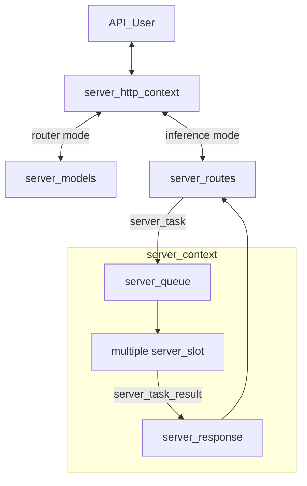
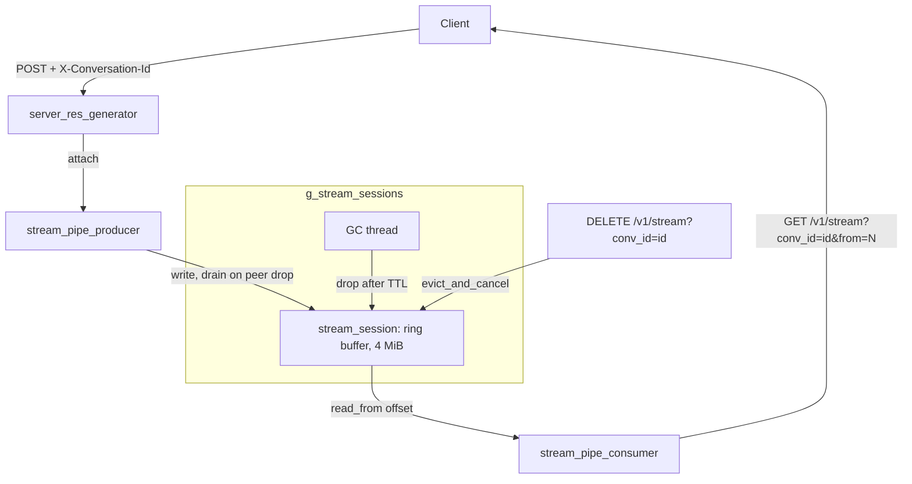

# llama-server Development Documentation

This document provides an in-depth technical overview of `llama-server`, intended for maintainers and contributors.

If you are an end user consuming `llama-server` as a product, please refer to the main [README](./README.md) instead.

## Scope of features

In-scope types of feature:

- Backend:
    - Basic inference features: text completion, embeddings output
    - Chat-oriented features: chat completion, tool calling
    - Third-party API compatibility, e.g. OAI-compat, Anthropic-compat
    - Multimodal input/output
    - Memory management: save/load state, context checkpoints
    - Model management
    - Features that are required by the Web UI
- Frontend:
    - Chat-oriented features, example: basic chat, image upload, edit messages
    - Agentic features, example: MCP
    - Model management

Note: For security reasons, features that require reading or writing external files must be **disabled by default**. This covers features like: MCP, model save/load

Out-of-scope features:

- Backend:
    - Features that require a loop of external API calls, e.g. server-side agentic loop. This is because external API calls in C++ are costly to maintain. Any complex third-party logic should be implemented outside of server code.
    - Features that expose the internal state of the model to the API, example: getting the intermediate activation from API. This is because llama.cpp doesn't support a stable API for doing this, and relying on `eval_callback` can make it complicated to maintain as this API is not intended to be used in multi-sequence setup.
    - Model-specific features. All API calls and features must remain model-agnostic.
- Frontend:
    - Third-party plugins, it is costly to maintain a public plugin API for such features. Instead, users can make their own MCP server for their needs.
    - Customizable themes, it is also costly to maintain. While we do focus on the aesthetic, we try to achieve this by perfecting a small set of themes.
    - Browser-specific features, example: [Chrome's built-in AI API](https://developer.chrome.com/docs/ai/built-in-apis).

## Backend

### Overview

The server supports two primary operating modes:

- **Inference mode**: The default mode for performing inference with a single loaded GGUF model.
- **Router mode**: Enables management of multiple inference server instances behind a single API endpoint. Requests are automatically routed to the appropriate backend instance based on the requested model.

The core architecture consists of the following components:

- `server_context`: Holds the primary inference state, including the main `llama_context` and all active slots.
- `server_slot`: An abstraction over a single “sequence” in llama.cpp, responsible for managing individual parallel inference requests.
- `server_routes`: Middleware layer between `server_context` and the HTTP interface; handles JSON parsing/formatting and request routing logic.
- `server_http_context`: Implements the HTTP server using `cpp-httplib`.
- `server_queue`: Thread-safe queue used by HTTP workers to submit new tasks to `server_context`.
- `server_response`: Thread-safe queue used by `server_context` to return results to HTTP workers.
- `server_response_reader`: Higher-level wrapper around the two queues above for cleaner code.
- `server_task`: Unit of work pushed into `server_queue`.
- `server_task_result`: Unit of result pushed into `server_response`.
- `server_tokens`: Unified representation of token sequences (supports both text and multimodal tokens); used by `server_task` and `server_slot`.
- `server_prompt_checkpoint`: For recurrent (e.g., RWKV) and SWA models, stores snapshots of KV cache state. Enables reuse when subsequent requests share the same prompt prefix, saving redundant computation.
- `server_models`: Standalone component for managing multiple backend instances (used in router mode). It is completely independent of `server_context`.
- `stream_session_manager`: process wide owner of resumable SSE stream sessions, keyed by conversation id. A file-static singleton inside `server-stream.cpp`, driven through `server_stream_session_manager_start/stop`. Backs the replay buffer that lets a client reattach to a generation after an HTTP disconnect. See the "Resumable streaming" section below.



### Batching

The server context maintains a single batch shared across all slots. When `update_slots()` is invoked, the system iterates through all active slots to populate this batch. For each slot, either a generated token from the previous decoding step or available prompt tokens are added to the batch.

Batching constraints apply: slots can only be batched together if they share compatible configurations. For instance, slots using a specific LoRA adapter can be batched with each other, but not with slots using a different LoRA adapter or no adapter at all.

Once the batch reaches capacity or all slots have been processed, `llama_decode` is called to execute the inference. This operation represents the primary computational bottleneck in `update_slots()`.

Following decoding, the system either retrieves embeddings or samples the next token using `common_sampler_sample`. If a slot has remaining prompt tokens to process, it yields until the next `update_slots()` iteration.

### Thread Management

`server_context` runs on a dedicated single thread. Because it is single-threaded, heavy post-processing (especially after token generation) should be avoided, as it directly impacts multi-sequence throughput.

Each incoming HTTP request is handled by its own thread managed by the HTTP library. The following operations are performed in HTTP worker threads:

- JSON request parsing
- Chat template application
- Tokenization
- Conversion of `server_task_result` into final JSON response
- Error formatting into JSON
- Tracking of partial/incremental responses (e.g., streaming tool calls or reasoning steps)

**Best practices to follow:**

- All JSON formatting and chat template logic must stay in the HTTP layer.
- Avoid passing raw JSON between the HTTP layer and `server_slot`. Instead, parse everything into native C++ types as early as possible.

### Example trace of a request

Here is an example trace of an API request for text completion:

- A request arrives at the HTTP layer.
- The request is routed to the corresponding handler inside `server_routes`. In this case, `handle_completions_impl` is invoked.
- The handler parses the input request, constructs a new `server_task`, and passes it to `server_res_generator`.
- `server_res_generator` creates a new `task_result_state` for each task:
    - `task_result_state` stays in the HTTP layer, responsible for keeping track of the current state of the response (e.g., parsing tool calls or thinking messages).
    - `server_task` is moved into `server_queue` inside `server_context`.
- `server_context` launches the task by moving it into an available slot (see `launch_slot_with_task()`).
- `update_slot()` processes the task as described in the "Batching" section above.
- Results may be sent using `send_partial_response` or `send_final_response`, which creates a new `server_task_result` and pushes it to the response queue.
- At the same time, `server_res_generator` listens to the response queue and retrieves this response.
- As the response is stateless, `server_res_generator` calls `response->update()` to update the response with the current state.
- `server_res_generator` then calls `response->to_json()` and passes the response to the HTTP layer.

### Resumable streaming (SSE replay buffer)

By default a streaming generation is bound to its HTTP socket: when the socket drops (refresh, tab close, mobile background, transient network) the generation aborts and the live stream is lost. This feature keeps the generation running server side and lets a client reattach.

It is opt in via the `X-Conversation-Id` header on `POST /v1/chat/completions`. Without the header the OAI strict path is unchanged. The conversation id is the only identity end to end (server map key, client localStorage key, route path), with an optional `::model` suffix for direct routing in router mode.

The feature lives entirely in `server-stream.{h,cpp}` and rests on three types:

- `stream_session`: a bounded ring buffer (4 MiB cap, oldest bytes drop first) plus a condvar. `append` pushes raw SSE bytes, `read_from` drains from any offset and blocks for live bytes or finalize, `finalize` wakes readers, `cancel` sets the flag the producer polls. One conv maps to at most one live session.
- `stream_session_manager`: a file-static singleton (`g_stream_sessions`) inside `server-stream.cpp`, owns all sessions keyed by conv id, enforces the one conv one session invariant via `create_or_replace`, and runs a GC thread that drops completed sessions past their TTL. Exposed to main only through `server_stream_session_manager_start/stop`.
- `stream_pipe_producer` / `stream_pipe_consumer`: the write and read ends. The producer owns the session lifetime and finalizes it on destruction; the consumer is read only and never finalizes, so a reader detaching cannot kill a running generation.

The implementation is hidden in `server-stream.cpp` (pimpl). The header exposes only the route handler factories, the `server_res_spipe` response base, `server_stream_conv_id_from_headers` and the GC lifecycle; the session, manager, consumer and the `server_stream_create_spipe` factory stay in the `.cpp`.

Producer side: `server_res_generator` extends `server_res_spipe`, which keeps all spipe logic out of the generic `server_http_res`. `set_req` attaches a producer when the header is present, and the wrapped `next` tees each chunk into the ring before the socket, so a chunk lost to a dead wire is already buffered. While attached, `should_stop` ignores peer disconnect: only a `DELETE` stops generation. On an early peer drop, `on_complete` drains the tail into the ring on the http worker.

Lifetime safety: the session holds no back reference to the response, so `spipe` is a plain `unique_ptr` touched only by the http worker. `cancel` raises an atomic the producer polls; the producer finalizes the session from its destructor, which also runs `~server_response_reader::stop()` to cancel the generation at the queue level. A `DELETE` stops work by raising the flag and letting the worker unwind.

Consumer side: `GET /v1/stream?conv_id=<id>&from=N` opens a `text/event-stream` that replays buffered bytes from offset `N` and blocks for live bytes, so the browser reattaches like a fresh EventSource. An offset below the dropped prefix returns 400.

Routes:

- `GET /v1/stream?conv_id=<id>&from=N`: replay or live reattach. The id travels in the query string because it can embed a model name containing slashes.
- `POST /v1/streams/lookup` with `{"conversation_ids": [...]}`: returns session status only for ids the caller already owns. There is no listing route, so live sessions cannot be enumerated (an earlier `GET /v1/streams` was removed for exactly this reason).
- `DELETE /v1/stream?conv_id=<id>`: explicit Stop, idempotent (`evict_and_cancel`).

Router mode binds the same paths to proxy handlers. A `conv_id -> child` map (`conv_models`), populated when a POST is routed, resolves the owning child in one lookup with no polling. The lookup groups ids per child; GET and DELETE proxy straight to the owner. This loopback REST hop is expected to move to a websocket IPC later, swapping only the transport.

Lifecycle: `server_stream_session_manager_start()` runs in main after common init, `server_stream_session_manager_stop()` runs first in `clean_up()` and finalizes every live session so no reader hangs. Reader blocking and the post drop drain both run on httplib worker threads, which block on a condvar rather than spin.

| Constant | Value | Role |
| --- | --- | --- |
| `STREAM_SESSION_TTL_SECONDS` | 300 | retention of a completed session before GC |
| `STREAM_SESSION_MAX_BYTES` | 4 MiB | ring cap per session |
| `STREAM_SESSION_GC_INTERVAL_SECONDS` | 60 | GC tick |
| `STREAM_READ_WAKE_INTERVAL_MS` | 200 | read_from wake to recheck should_stop |
| `STREAM_LOOKUP_TIMEOUT_MS` | 250 | router to child loopback budget |



The diagram shows the buffer touch points. The live wire (chunks streamed to the original client during a normal generation) is the producer's default output, described under "Producer side" above.

### Testing

`llama-server` includes an automated test suite based on `pytest`.

The framework automatically starts a `llama-server` instance, sends requests, and validates responses.

For detailed instructions, see the [test documentation](./tests/README.md).

### API for tools

This endpoint is intended to be used internally by the Web UI and subject to change or to be removed in the future.

**GET /tools**

Get a list of tools, each tool has these fields:
- `tool` (string): the ID name of the tool, to be used in POST call. Example: `read_file`
- `display_name` (string): the name to be displayed on UI. Example: `Read file`
- `type` (string): `"builtin"` for a built-in tool, or `"mcp"` for a tool exposed by an MCP server
- `permissions` (object): a mapping string --> boolean that indicates the permission required by this tool. This is useful for the UI to ask the user before calling the tool. For now, the only permission supported is `"write"`
- `definition` (object): the OAI-compat definition of this tool

**POST /tools**

Invoke a tool call, request body is a JSON object with:
- `tool` (string): the name of the tool
- `params` (object): a mapping from argument name (string) to argument value

Headers:
- `x-tool-cwd`: optional; if set, use as the CWD for tool; this is not part of tool's params because it's meant to be set by the runtime, not the LLM itself
- `x-tool-runtime`: optional; if set, run the tool inside this isolate instead of on the host. Either `docker-container:<id>` or `podman-container:<id>`, using an already-running container, or `ssh:<target>`, running the tool on a remote host

Returns JSON object. There are two response formats (MCP tools use the same two formats: their result content is concatenated into `plain_text_response`, and RPC or tool errors are surfaced as the `error` string):

Format 1: Plain text. The text will be placed into a field called `plain_text_response`, example:

```json
{
    "plain_text_response": "this is a text response"
}
```

The client should extract this value and place it inside message content (note: content is no longer a JSON), example

```json
{
    "role": "tool",
    "content": "this is a text response"
}
```

Format 2: Normal JSON response, example:

```json
{
    "error": "cannot open this file"
}
```

That requires `JSON.stringify` when formatted to message content:

```json
{
    "role": "tool",
    "content": "{\"error\":\"cannot open this file\"}"
}
```

Set `stream: true` in the request body to stream a tool's output as it runs, instead of waiting for it to finish. Only certain tools accept this (for ex. `exec_shell_command`);
returns 404 if tool doesn't support it.

Response is SSE stream, one `data: <json>` line per chunk:

```json
{"chunk": "hello\n"}
```

followed by a final event once the tool returns:

```json
{"done": true}
```

or, if `invoke()` threw:

```json
{"done": true, "error": "..."}
```

There is no `[DONE]` sentinel (unlike `/chat/completions`), the stream ends after the `done`

### Router mode: how child <--> router communicates

Upon spawning a new child process using `subprocess`, both child and router listen to the stdout/stderr (combined)

For the direction from child to router:
- Generic messages are logs, it will be forwarded to router's stdout
- Special state update messages are prefixed by `cmd_child_to_router:state:`, followed by a JSON. See `server_models::handle_child_state` for more

For the direction from router to child:
- When server sends `cmd_router_to_child:exit`, the child should exit gracefully --> if after `DEFAULT_STOP_TIMEOUT` and the child is still running, force-kill it

### Model management API (router mode)

Model management API was added via PR [#23976](https://github.com/ggml-org/llama.cpp/pull/23976)

The main goal of this API is to allow downloading models and/or removing models from the web UI. It relies on the model cache infrastructure under the hood to manage the list of models dynamically.

Instead of building everything from the ground up (like what most AI agents will do when you ask them to implement a similar feature), we built on top of existing, already well-engineered components inside the codebase:
- Model cache infrastructure as mentioned above (`common/download.h`)
- Server response queue (`server-queue.h`). We use this feature to broadcast events to SSE clients.
- Server router thread management (`server-models.h`). We re-use the same thread model that is used for managing subprocess life cycle, except that we don't create a new subprocess, but launch the download right inside the thread.

The flow for downloading a new model:
- POST request comes in --> `post_router_models` --> validation
- A new `llama-server` subprocess will be spawned with special `SERVER_CHILD_MODE_DOWNLOAD`
- Child process runs the download and report status back to router via stdin/out
- If a stop request comes in, the router asks the child process to stop (same mechanism as running a model in child process)
- Otherwise, upon completion, we call `load_models()` to refresh the list of models

### Notable Related PRs

- Initial server implementation: https://github.com/ggml-org/llama.cpp/pull/1443
- Parallel decoding support: https://github.com/ggml-org/llama.cpp/pull/3228
- Refactor introducing `server_queue` and `server_response`: https://github.com/ggml-org/llama.cpp/pull/5065
- Reranking endpoint: https://github.com/ggml-org/llama.cpp/pull/9510
- Multimodal model support (`libmtmd`): https://github.com/ggml-org/llama.cpp/pull/12898
- Unified KV cache handling: https://github.com/ggml-org/llama.cpp/pull/16736
- Separation of HTTP logic into dedicated files: https://github.com/ggml-org/llama.cpp/pull/17216
- Large-scale code base split into smaller files: https://github.com/ggml-org/llama.cpp/pull/17362
- Introduction of router mode: https://github.com/ggml-org/llama.cpp/pull/17470
- Speculative decoding: https://github.com/ggml-org/llama.cpp/pull/17808 and rework in https://github.com/ggml-org/llama.cpp/pull/17808
- INI presets: https://github.com/ggml-org/llama.cpp/pull/17859 (+ refactoring: https://github.com/ggml-org/llama.cpp/pull/18169)
- Sleeping mode: https://github.com/ggml-org/llama.cpp/pull/18228
- Resumable streaming (SSE replay buffer): https://github.com/ggml-org/llama.cpp/pull/23226


## Web UI

The project includes a web-based user interface for interacting with `llama-server`. It supports both single-model (`MODEL` mode) and multi-model (`ROUTER` mode) operation.

The SvelteKit-based Web UI is introduced in this PR: https://github.com/ggml-org/llama.cpp/pull/14839

### Features

-   **Chat interface** with streaming responses
-   **Multi-model support** (ROUTER mode) - switch between models, auto-load on selection
-   **Modality validation** - ensures selected model supports conversation's attachments (images, audio)
-   **Conversation management** - branching, regeneration, editing with history preservation
-   **Attachment support** - images, audio, PDFs (with vision/text fallback)
-   **Configurable parameters** - temperature, top_p, etc. synced with server defaults
-   **Dark/light theme**

### Tech Stack

-   **SvelteKit** - frontend framework with Svelte 5 runes for reactive state
-   **TailwindCSS** + **shadcn-svelte** - styling and UI components
-   **Vite** - build tooling
-   **IndexedDB** (Dexie) - local storage for conversations
-   **LocalStorage** - user settings persistence

### Architecture

The UI follows a layered architecture:

```
Routes → Components → Hooks → Stores → Services → Storage/API
```

-   **Stores** - reactive state management (`chatStore`, `conversationsStore`, `modelsStore`, `serverStore`, `settingsStore`)
-   **Services** - stateless API/database communication (`ChatService`, `ModelsService`, `PropsService`, `DatabaseService`)
-   **Hooks** - reusable logic (`useModelChangeValidation`, `useProcessingState`)

For detailed architecture diagrams, see [`tools/ui/docs/`](../ui/docs/):

-   `high-level-architecture.mmd` - full architecture with all modules
-   `high-level-architecture-simplified.mmd` - simplified overview
-   `data-flow-simplified-model-mode.mmd` - data flow for single-model mode
-   `data-flow-simplified-router-mode.mmd` - data flow for multi-model mode
-   `flows/*.mmd` - detailed per-domain flows (chat, conversations, models, etc.)

### Development

```sh
# make sure you have Node.js installed
cd tools/ui
npm i

# run dev server (with hot reload)
npm run dev

# run tests
npm run test

# build production bundle
npm run build
```

After `public/index.html` has been generated, rebuild `llama-server` as described in the [build](#build) section to include the updated UI.

**Note:** The Vite dev server automatically proxies API requests to `http://localhost:8080`. Make sure `llama-server` is running on that port during development.
