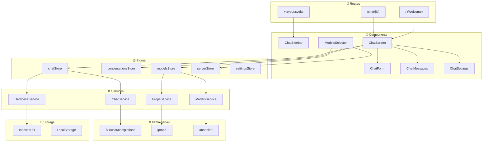
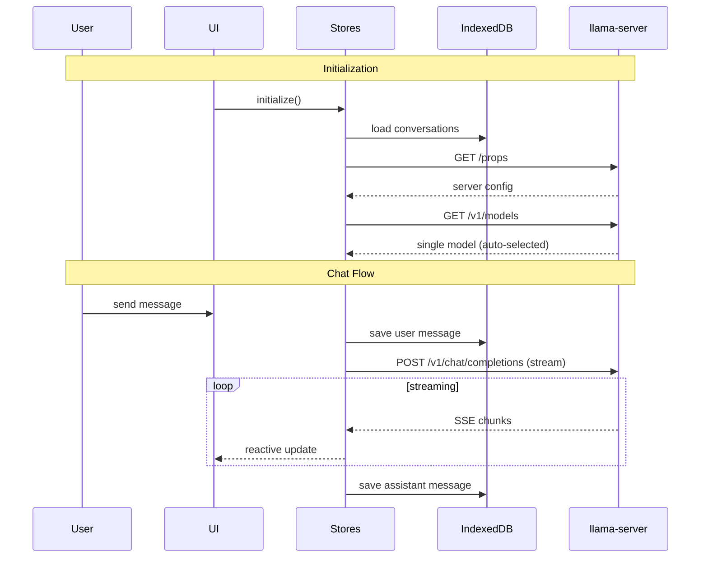
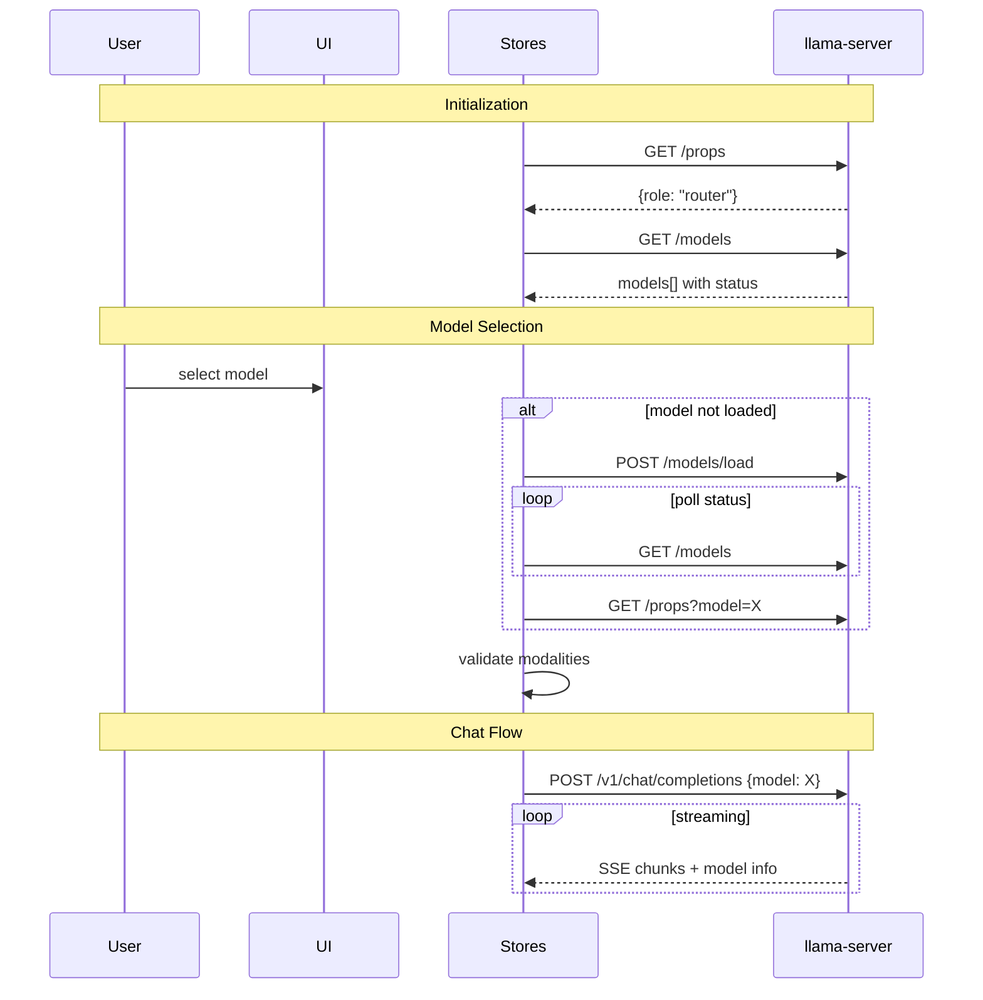
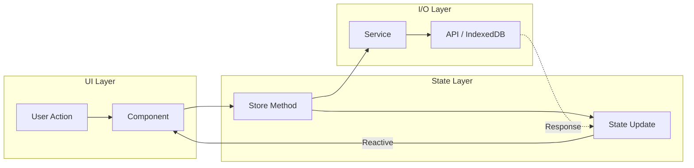
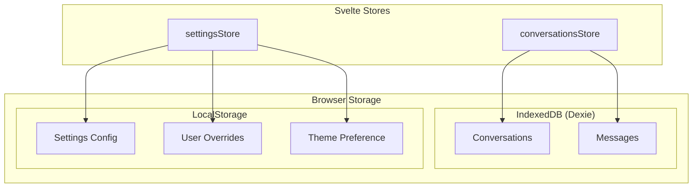

# llama.cpp Web UI

A modern, feature-rich web interface for llama.cpp built with SvelteKit. This UI provides an intuitive chat interface with advanced file handling, conversation management, and comprehensive model interaction capabilities.

The WebUI supports two server operation modes:

- **MODEL mode** - Single model operation (standard llama-server)
- **ROUTER mode** - Multi-model operation with dynamic model loading/unloading

---

## Table of Contents

- [Features](#features)
- [Getting Started](#getting-started)
- [Tech Stack](#tech-stack)
- [Build Pipeline](#build-pipeline)
- [Architecture](#architecture)
- [Data Flows](#data-flows)
- [Architectural Patterns](#architectural-patterns)
- [Testing](#testing)

---

## Features

### Chat Interface

- **Streaming responses** with real-time updates
- **Reasoning content** - Support for models with thinking/reasoning blocks
- **Dark/light theme** with system preference detection
- **Responsive design** for desktop and mobile

### File Attachments

- **Images** - JPEG, PNG, GIF, WebP, SVG (with PNG conversion)
- **Documents** - PDF (text extraction or image conversion for vision models)
- **Audio** - MP3, WAV for audio-capable models
- **Text files** - Source code, markdown, and other text formats
- **Drag-and-drop** and paste support with rich previews

### Conversation Management

- **Branching** - Branch messages conversations at any point by editing messages or regenerating responses, navigate between branches
- **Regeneration** - Regenerate responses with optional model switching (ROUTER mode)
- **Import/Export** - JSON format for backup and sharing
- **Search** - Find conversations by title or content

### Advanced Rendering

- **Syntax highlighting** - Code blocks with language detection
- **Math formulas** - KaTeX rendering for LaTeX expressions
- **Markdown** - Full GFM support with tables, lists, and more

### Multi-Model Support (ROUTER mode)

- **Model selector** with Loaded/Available groups
- **Automatic loading** - Models load on selection
- **Modality validation** - Prevents sending images to non-vision models
- **LRU unloading** - Server auto-manages model cache

### Keyboard Shortcuts

| Shortcut           | Action               |
| ------------------ | -------------------- |
| `Shift+Ctrl/Cmd+O` | New chat             |
| `Shift+Ctrl/Cmd+E` | Edit conversation    |
| `Shift+Ctrl/Cmd+D` | Delete conversation  |
| `Ctrl/Cmd+K`       | Search conversations |
| `Ctrl/Cmd+B`       | Toggle sidebar       |

### Developer Experience

- **Request tracking** - Monitor token generation with `/slots` endpoint
- **Storybook** - Component library with visual testing
- **Hot reload** - Instant updates during development

---

## Getting Started

### Prerequisites

- **Node.js** 18+ (20+ recommended)
- **npm** 9+
- **llama-server** running locally (for API access)

### 1. Install Dependencies

```bash
cd tools/server/webui
npm install
```

### 2. Start llama-server

In a separate terminal, start the backend server:

```bash
# Single model (MODEL mode)
./llama-server -m model.gguf

# Multi-model (ROUTER mode)
./llama-server --model-store /path/to/models
```

### 3. Start Development Servers

```bash
npm run dev
```

This starts:

- **Vite dev server** at `http://localhost:5173` - The main WebUI
- **Storybook** at `http://localhost:6006` - Component documentation

The Vite dev server proxies API requests to `http://localhost:8080` (default llama-server port):

```typescript
// vite.config.ts proxy configuration
proxy: {
  '/v1': 'http://localhost:8080',
  '/props': 'http://localhost:8080',
  '/slots': 'http://localhost:8080',
  '/models': 'http://localhost:8080'
}
```

### Development Workflow

1. Open `http://localhost:5173` in your browser
2. Make changes to `.svelte`, `.ts`, or `.css` files
3. Changes hot-reload instantly
4. Use Storybook at `http://localhost:6006` for isolated component development

---

## Tech Stack

| Layer             | Technology                      | Purpose                                                  |
| ----------------- | ------------------------------- | -------------------------------------------------------- |
| **Framework**     | SvelteKit + Svelte 5            | Reactive UI with runes (`$state`, `$derived`, `$effect`) |
| **UI Components** | shadcn-svelte + bits-ui         | Accessible, customizable component library               |
| **Styling**       | TailwindCSS 4                   | Utility-first CSS with design tokens                     |
| **Database**      | IndexedDB (Dexie)               | Client-side storage for conversations and messages       |
| **Build**         | Vite                            | Fast bundling with static adapter                        |
| **Testing**       | Playwright + Vitest + Storybook | E2E, unit, and visual testing                            |
| **Markdown**      | remark + rehype                 | Markdown processing with KaTeX and syntax highlighting   |

### Key Dependencies

```json
{
	"svelte": "^5.0.0",
	"bits-ui": "^2.8.11",
	"dexie": "^4.0.11",
	"pdfjs-dist": "^5.4.54",
	"highlight.js": "^11.11.1",
	"rehype-katex": "^7.0.1"
}
```

---

## Build Pipeline

### Development Build

```bash
npm run dev
```

Runs Vite in development mode with:

- Hot Module Replacement (HMR)
- Source maps
- Proxy to llama-server

### Production Build

```bash
npm run build
```

The build process:

1. **Vite Build** - Bundles all TypeScript, Svelte, and CSS
2. **Static Adapter** - Outputs to `../public` (llama-server's static file directory)
3. **Post-Build Script** - Cleans up intermediate files
4. **Custom Plugin** - Creates `index.html.gz` with:
   - Inlined favicon as base64
   - GZIP compression (level 9)
   - Deterministic output (zeroed timestamps)

```text
tools/server/webui/        →  build  →  tools/server/public/
├── src/                                 ├── index.html.gz  (served by llama-server)
├── static/                              └── (favicon inlined)
└── ...
```

### SvelteKit Configuration

```javascript
// svelte.config.js
adapter: adapter({
  pages: '../public',      // Output directory
  assets: '../public',     // Static assets
  fallback: 'index.html',  // SPA fallback
  strict: true
}),
output: {
  bundleStrategy: 'inline' // Single-file bundle
}
```

### Integration with llama-server

The WebUI is embedded directly into the llama-server binary:

1. `npm run build` outputs `index.html.gz` to `tools/server/public/`
2. llama-server compiles this into the binary at build time
3. When accessing `/`, llama-server serves the gzipped HTML
4. All assets are inlined (CSS, JS, fonts, favicon)

This results in a **single portable binary** with the full WebUI included.

---

## Architecture

The WebUI follows a layered architecture with unidirectional data flow:

```text
Routes → Components → Hooks → Stores → Services → Storage/API
```

### High-Level Architecture

See: [`docs/architecture/high-level-architecture-simplified.md`](docs/architecture/high-level-architecture-simplified.md)



### Layer Breakdown

#### Routes (`src/routes/`)

- **`/`** - Welcome screen, creates new conversation
- **`/chat/[id]`** - Active chat interface
- **`+layout.svelte`** - Sidebar, navigation, global initialization

#### Components (`src/lib/components/`)

Components are organized in `app/` (application-specific) and `ui/` (shadcn-svelte primitives).

**Chat Components** (`app/chat/`):

| Component          | Responsibility                                                              |
| ------------------ | --------------------------------------------------------------------------- |
| `ChatScreen/`      | Main chat container, coordinates message list, input form, and attachments  |
| `ChatForm/`        | Message input textarea with file upload, paste handling, keyboard shortcuts |
| `ChatMessages/`    | Message list with branch navigation, regenerate/continue/edit actions       |
| `ChatAttachments/` | File attachment previews, drag-and-drop, PDF/image/audio handling           |
| `ChatSettings/`    | Parameter sliders (temperature, top-p, etc.) with server default sync       |
| `ChatSidebar/`     | Conversation list, search, import/export, navigation                        |

**Dialog Components** (`app/dialogs/`):

| Component                       | Responsibility                                           |
| ------------------------------- | -------------------------------------------------------- |
| `DialogChatSettings`            | Full-screen settings configuration                       |
| `DialogModelInformation`        | Model details (context size, modalities, parallel slots) |
| `DialogChatAttachmentPreview`   | Full preview for images, PDFs (text or page view), code  |
| `DialogConfirmation`            | Generic confirmation for destructive actions             |
| `DialogConversationTitleUpdate` | Edit conversation title                                  |

**Server/Model Components** (`app/server/`, `app/models/`):

| Component           | Responsibility                                            |
| ------------------- | --------------------------------------------------------- |
| `ServerErrorSplash` | Error display when server is unreachable                  |
| `ModelsSelector`    | Model dropdown with Loaded/Available groups (ROUTER mode) |

**Shared UI Components** (`app/misc/`):

| Component                        | Responsibility                                                   |
| -------------------------------- | ---------------------------------------------------------------- |
| `MarkdownContent`                | Markdown rendering with KaTeX, syntax highlighting, copy buttons |
| `SyntaxHighlightedCode`          | Code blocks with language detection and highlighting             |
| `ActionButton`, `ActionDropdown` | Reusable action buttons and menus                                |
| `BadgeModality`, `BadgeInfo`     | Status and capability badges                                     |

#### Hooks (`src/lib/hooks/`)

- **`useModelChangeValidation`** - Validates model switch against conversation modalities
- **`useProcessingState`** - Tracks streaming progress and token generation

#### Stores (`src/lib/stores/`)

| Store                | Responsibility                                            |
| -------------------- | --------------------------------------------------------- |
| `chatStore`          | Message sending, streaming, abort control, error handling |
| `conversationsStore` | CRUD for conversations, message branching, navigation     |
| `modelsStore`        | Model list, selection, loading/unloading (ROUTER)         |
| `serverStore`        | Server properties, role detection, modalities             |
| `settingsStore`      | User preferences, parameter sync with server defaults     |

#### Services (`src/lib/services/`)

| Service                | Responsibility                                  |
| ---------------------- | ----------------------------------------------- |
| `ChatService`          | API calls to`/v1/chat/completions`, SSE parsing |
| `ModelsService`        | `/models`, `/models/load`, `/models/unload`     |
| `PropsService`         | `/props`, `/props?model=`                       |
| `DatabaseService`      | IndexedDB operations via Dexie                  |
| `ParameterSyncService` | Syncs settings with server defaults             |

---

## Data Flows

### MODEL Mode (Single Model)

See: [`docs/flows/data-flow-simplified-model-mode.md`](docs/flows/data-flow-simplified-model-mode.md)



### ROUTER Mode (Multi-Model)

See: [`docs/flows/data-flow-simplified-router-mode.md`](docs/flows/data-flow-simplified-router-mode.md)



### Detailed Flow Diagrams

| Flow          | Description                                | File                                                        |
| ------------- | ------------------------------------------ | ----------------------------------------------------------- |
| Chat          | Message lifecycle, streaming, regeneration | [`chat-flow.md`](docs/flows/chat-flow.md)                   |
| Models        | Loading, unloading, modality caching       | [`models-flow.md`](docs/flows/models-flow.md)               |
| Server        | Props fetching, role detection             | [`server-flow.md`](docs/flows/server-flow.md)               |
| Conversations | CRUD, branching, import/export             | [`conversations-flow.md`](docs/flows/conversations-flow.md) |
| Database      | IndexedDB schema, operations               | [`database-flow.md`](docs/flows/database-flow.md)           |
| Settings      | Parameter sync, user overrides             | [`settings-flow.md`](docs/flows/settings-flow.md)           |

---

## Architectural Patterns

### 1. Reactive State with Svelte 5 Runes

All stores use Svelte 5's fine-grained reactivity:

```typescript
// Store with reactive state
class ChatStore {
	#isLoading = $state(false);
	#currentResponse = $state('');

	// Derived values auto-update
	get isStreaming() {
		return $derived(this.#isLoading && this.#currentResponse.length > 0);
	}
}

// Exported reactive accessors
export const isLoading = () => chatStore.isLoading;
export const currentResponse = () => chatStore.currentResponse;
```

### 2. Unidirectional Data Flow

Data flows in one direction, making state predictable:



Components dispatch actions to stores, stores coordinate with services for I/O, and state updates reactively propagate back to the UI.

### 3. Per-Conversation State

Enables concurrent streaming across multiple conversations:

```typescript
class ChatStore {
	chatLoadingStates = new Map<string, boolean>();
	chatStreamingStates = new Map<string, { response: string; messageId: string }>();
	abortControllers = new Map<string, AbortController>();
}
```

### 4. Message Branching with Tree Structure

Conversations are stored as a tree, not a linear list:

```typescript
interface DatabaseMessage {
	id: string;
	parent: string | null; // Points to parent message
	children: string[]; // List of child message IDs
	// ...
}

interface DatabaseConversation {
	currentNode: string; // Currently viewed branch tip
	// ...
}
```

Navigation between branches updates `currentNode` without losing history.

### 5. Layered Service Architecture

Stores handle state; services handle I/O:

```text
┌─────────────────┐
│     Stores      │  Business logic, state management
├─────────────────┤
│    Services     │  API calls, database operations
├─────────────────┤
│   Storage/API   │  IndexedDB, LocalStorage, HTTP
└─────────────────┘
```

### 6. Server Role Abstraction

Single codebase handles both MODEL and ROUTER modes:

```typescript
// serverStore.ts
get isRouterMode() {
  return this.role === ServerRole.ROUTER;
}

// Components conditionally render based on mode
{#if isRouterMode()}
  <ModelsSelector />
{/if}
```

### 7. Modality Validation

Prevents sending attachments to incompatible models:

```typescript
// useModelChangeValidation hook
const validate = (modelId: string) => {
	const modelModalities = modelsStore.getModelModalities(modelId);
	const conversationModalities = conversationsStore.usedModalities;

	// Check if model supports all used modalities
	if (conversationModalities.hasImages && !modelModalities.vision) {
		return { valid: false, reason: 'Model does not support images' };
	}
	// ...
};
```

### 8. Persistent Storage Strategy

Data is persisted across sessions using two storage mechanisms:



- **IndexedDB**: Conversations and messages (large, structured data)
- **LocalStorage**: Settings, user parameter overrides, theme (small key-value data)
- **Memory only**: Server props, model list (fetched fresh on each session)

---

## Testing

### Test Types

| Type          | Tool               | Location         | Command             |
| ------------- | ------------------ | ---------------- | ------------------- |
| **Unit**      | Vitest             | `tests/unit/`    | `npm run test:unit` |
| **UI/Visual** | Storybook + Vitest | `tests/stories/` | `npm run test:ui`   |
| **E2E**       | Playwright         | `tests/e2e/`     | `npm run test:e2e`  |
| **Client**    | Vitest             | `tests/client/`. | `npm run test:unit` |

### Running Tests

```bash
# All tests
npm run test

# Individual test suites
npm run test:e2e      # End-to-end (requires llama-server)
npm run test:client   # Client-side unit tests
npm run test:server   # Server-side unit tests
npm run test:ui       # Storybook visual tests
```

### Storybook Development

```bash
npm run storybook     # Start Storybook dev server on :6006
npm run build-storybook  # Build static Storybook
```

### Linting and Formatting

```bash
npm run lint          # Check code style
npm run format        # Auto-format with Prettier
npm run check         # TypeScript type checking
```

---

## Project Structure

```text
tools/server/webui/
├── src/
│   ├── lib/
│   │   ├── components/   # UI components (app/, ui/)
│   │   ├── hooks/        # Svelte hooks
│   │   ├── stores/       # State management
│   │   ├── services/     # API and database services
│   │   ├── types/        # TypeScript interfaces
│   │   └── utils/        # Utility functions
│   ├── routes/           # SvelteKit routes
│   └── styles/           # Global styles
├── static/               # Static assets
├── tests/                # Test files
├── docs/                 # Architecture diagrams
│   ├── architecture/     # High-level architecture
│   └── flows/            # Feature-specific flows
└── .storybook/           # Storybook configuration
```

---

## Related Documentation

- [llama.cpp Server README](../README.md) - Full server documentation
- [Multimodal Documentation](../../../docs/multimodal.md) - Image and audio support
- [Function Calling](../../../docs/function-calling.md) - Tool use capabilities
